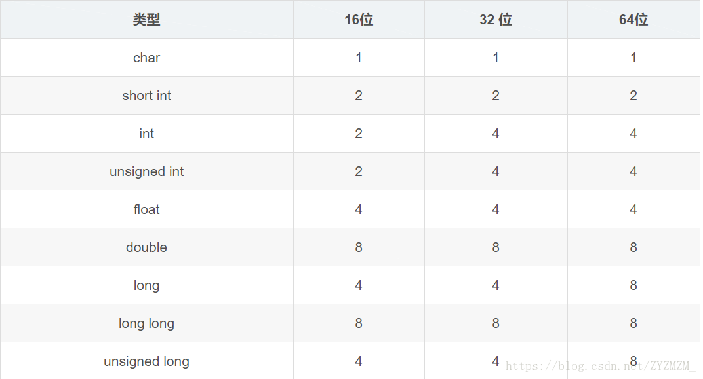
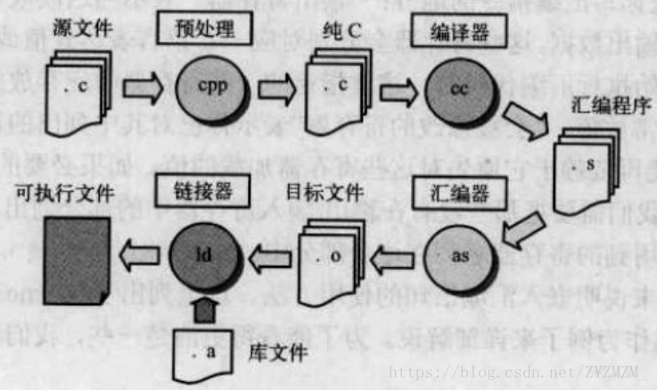
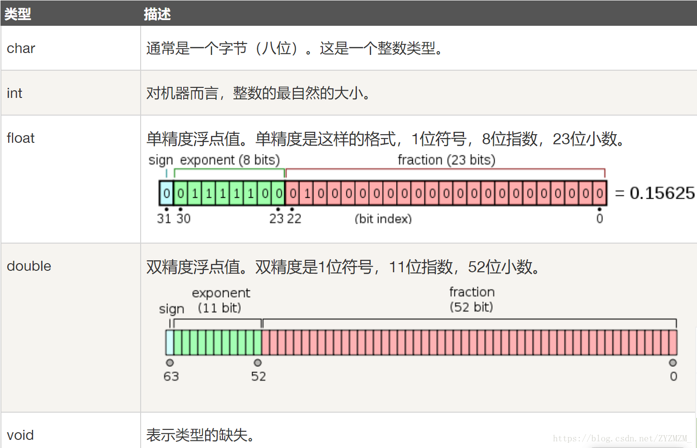
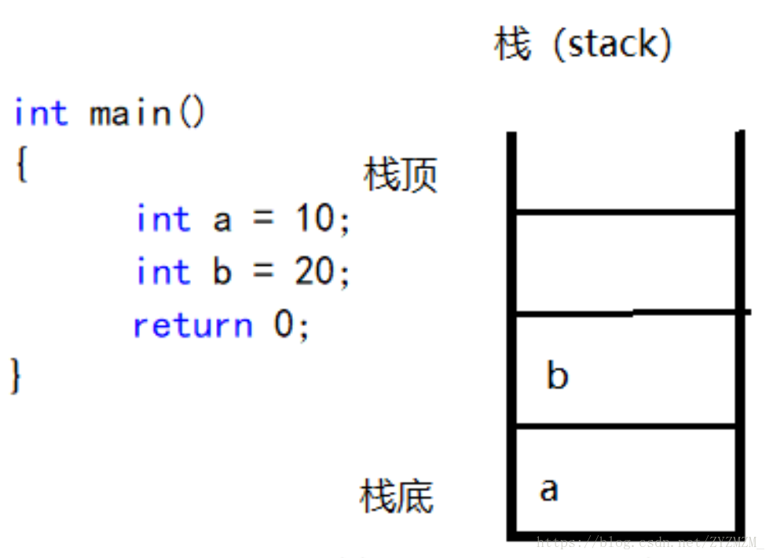
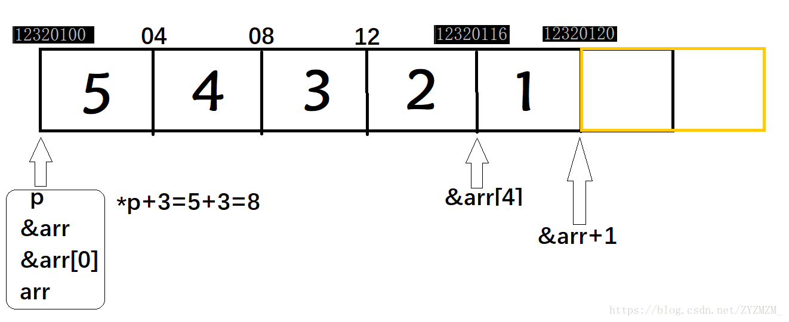
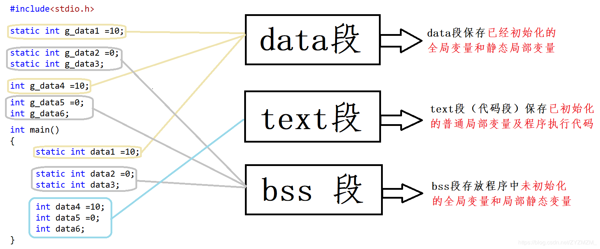
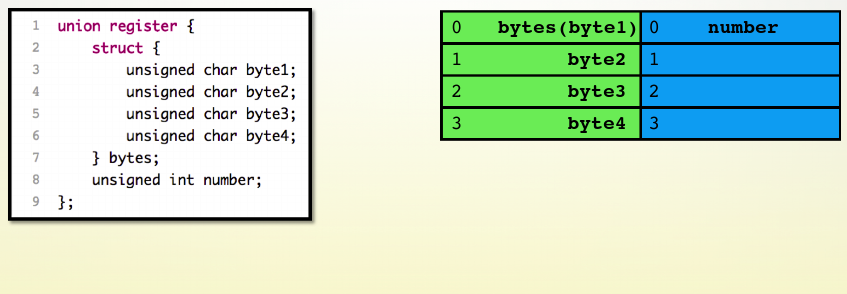

##　C语言基础

[TOC]

### 数制

对于一个 10 进制整型 int 数字，12 转化为二进制数字 0000 1100，八进制 0000 0014，十六进制：`0x0C`

求反码补码，正数的补码反码都是一样的，区别在与负数的补码，对一个负数求补码至于要取绝对值然后取反加 1 就可。（按位取反末位加１）

**`ASCLL`的数值取值范围为什么是0 - 127 ?**

因为<font color=red>提高代码可移植性</font>，无符号取值范围是0~255, 有符号的取值范围范围是-128~+127, 两个取值范围的交集是0~127, 所以`ASCLL `的取值正好是这个地方

### 基本数据类型





> <font color =red>short , int, long, char, double</font>这六个关键字代表ｃ语言中六种基本类型。
> 在不同系统上，他们占据字节长度是不同的：
> 在３２位系统上
> <font color = blue>short</font>占据的内存大小是<font color=red>2个byte</font>
> <font color = blue>int</font>占据的内存大小是<font color=red>4个byte</font>
><font color = blue>long</font>占据的内存大小是<font color=red>4个byte</font>
><font color = blue>float</font>占据的内存大小是<font color=red>4个byte</font>
><font color = blue>double</font>占据的内存大小是<font color=red>8个byte</font>
><font color = blue>char</font>占据的内存大小是<font color=red>1个byte</font> 

### 关于char的死循环

```cpp
int main()
{
    for(char i = 0;i < 128;i++)
    {    
        printf(“%d ”,i);//为什么死循环
    }
    return 0;
}
```

 程序分析：

上述的for循环语句，i 的取值从0到127这阶段的循环语句执行正常。当i=128时，由于超出char取值范围，编译器会将ch值变为-128，仍然满足 < 128条件，继续执行循环，同时 i++。由于每次for循环 i 都自增（ i++），i 值将会逐渐从-128递增到0，这时又回到了for循环的起始条件处( i =0)，当再次递增到127后，i 值又会变为-128，以后不断循环。 从以上分析中可以看出，“ i++ ”语句并没有使i值一直增加，相反 i 值不断在“-128到127”中循环变化，使得 “i<128” 永远成立，程序陷入死循环。

### 第一个C语言程序

> (1)#include<stdio.h>//包含我们需要的库函数printf();
>
> (2) printf()函数，分别打印各种类型是所需要的格式化符不一样。
>
> (3) 每一个程序在从源码到执行所需要的过程：预编译，编译，汇编，链接 



### scanf函数的不安全性分析

> 通过`scanf`函数可以接受任何的键盘输入，如果输入长度超过了给定的缓冲区，就会覆盖其他数据区，这就是称为<font color = red>"堆栈溢出"</font>或<font color = red>"缓冲区溢出"</font> 。而`scanf`函数有三个特点：
> １．取数据时遇到空格、回车、ＴＡＢ就会停止
> ２．`scanf` 函数和都是从<B>输入流缓冲区</B> 读取数据的，而不是从键盘（终端）缓冲区读取值的。读取<font color = red >遇到回车\n就结束</font>，且回车`\n`会被读入输入缓冲数据流中，这样第二次的读入函数将缓冲区中的`\n`读取走了，没有等待键盘的第二次输入。
> ３． `scanf`读取字符串时，<font color = red > 会舍弃最后的回车符 </font>。

### 变量及类型转换



int a = 10;计算机会分配 4 个字节给变量a存储 10，且是二进制。在定义变量的时候;

那么，在C语言运行的时候变量到底储存在内存的什么地方呢？首先我们需要知道，内存被分为**栈（stack）**和**堆（heap）**。**变量是储存在栈上的**，就像这样



根据代码的执行顺序，**变量a首先被压入栈中，然后是变量b**。出栈时，是b先出栈，然后是a，即先进后出。**变量在程序执行完毕后会自动释放掉存储单元。**
**内存中栈有多大？而堆又有多大？**  栈对于不同的机器都不相同，大约1M-2M。
**堆原则上是没限制的**，你的硬件有多大的存储空间就可以分配相应大小的堆，另外定义在堆中的需要程序员**手动回收**。
当不同类型变量之间发生赋值的时候，会发生一些转换。分别有**显式类型转换**和**隐式类型转换**。

**大小端：**

大端模式，是指**数据的高字节**保存在内存的**低地址**中，而数据的低字节保存在内存的高地址中，这样的存储模式有点儿类似于把数据当作字符串顺序处理：地址由小向大增加，而数据从高位往低位放；这和我们的阅读习惯一致。

小端模式，是指**数据的高字节**保存在内存的**高地址**中，而数据的低字节保存在内存的低地址中，这种存储模式将地址的高低和数据位权有效地结合起来，高地址部分权值高，低地址部分权值低。

## C程序指针（一）

### 指针

**指针**是一个变量，其值为另一个变量的地址，即，<font color=red>内存位置的直接地址</font>。 

```cpp
int *p;  //野指针
int *p = NULL;   //0号地址   不能访问0号地址
```

```cpp
printf("%d",p[i])    // *(p+i);  *解引用    []自带解引用
int *p       p+1表示p向后挪4个字节（int* 类型）
```

<font color=red>一个任何类型的指针变量所占的字节大小都为4个字节</font>

```cpp
int *p=&a
int **pp=&p
int ***ppp=&pp
```

<font color = red>一级指针：变量的地址</font>
<font color=red> 二级指针：存放的是一级指针的地址</font>

```cpp
int a = 10;
int *p = &a; //一级指针存放变量地址 即 p=&a
int **p = &p;  //二级指针存放的是一级指针的地址
```

### 常量指针

```cpp
int * const p，p是一个常量类型的指针，不能修改这个指针的指向，但是这个指针所指向的地址上存储的值可以修改。
```

```cpp
int const *p=&a  
*p=100(正确，可以修改指针所指向的地址上存储的值)
p=&b（错误，不能修改指针指向）
```

### 指向常量的指针

```cpp
const int *p，定义一个指针指向一个常量，不能通过指针来修改这个指针指向的值
```

```cpp
const int *p=&a  
*p=100(错误，不能修改指针所指向的地址上存储的值)
p=&b（正确，可以修改指针指向）
```

### 访问数组中的元素

```cpp
int arr[5] = {5,4,3,2,1};
int len = sizeof(arr)/sizeof(arr[0]);
int *p = arr;   //p指向arr数组的首元素
int a = *p+3;   //*p+3为arr数组首元素的值加3
printf("%d\n",a);  
printf("%d\n",&arr);       //数组名代表首元素的首地址
printf("%d\n",&arr+1);     //&arr+1代表首地址加数组的length
printf("%d\n",&arr[0]);    //arr[0]的地址
printf("%d\n",&arr[4]);    //arr[4]的地址
printf("%d\n",arr);        //数组名代表首元素的首地址
```



### 字符数组

```cpp
char crr[5]={'a','b','c','d'};      //字符数组,元素用单引号，最后补'\0'(结束标志)
char crr[5]={'a','b','c','d','e'};  //此时最后无'\0', %s打印时会遇到错误
char crr[5]="abcd";   //也是字符数组，最后默认加 '\0'
char crr[5]="abcde";  //错误，默认最后加 '\0'
```

### **'\0'  '0'  "0" 0的区别**

在[C语言](http://lib.csdn.net/base/c)中，字符是按其所对应的ASCII码来存储的，一个字符占一个字节

```cpp
char ch1 = 0x00;   //0
char ch3 = 0;      //0
char ch4 = '\0';   //0
char ch2 = '0';   //48
```

**'0' 和 "0"**

> **字符常量由单引号括起来；字符串常量由双引号括起来
> 字符常量只能是单个字符；字符串常量则可以含一个或多个字符**

**'\0' 和 '0'**

```cpp
它们都是字符，在C/C++语言中，字符是按其所对应的ASCII码来存储的，一个字符占一个字节。第一个ASCII码是0，对应的字符是Null，其实就是'\0'，即空字符。判断一个字符串是否结束的标志就是看是否遇到'\0'，'\0'表示字符串结束。字符'0'对应的ASCII码是48，通常用字符转化为数字会用到，比如要将'7'转换为数字7，即 '7'-'0'。但是字符常量也可以像整数一样在程序中参与相关运算。如：'7'-3；此时要注意它是把'7'转换成对应的ASCII码再运算。
```

### sizeof与strlen的区别与联系

>**sizeof** 返回的是变量声明后所占的**内存数**，**不是实际长度**，**计算时包括 '\0',**此外**sizeof不是函数，仅仅是一个操作符**，**strlen是函数。**
>
>**strlen()是一个函数**，测量的是**字符的实际长度**，以'\0' 结束，但**计算时不包括 '\0'**

```cpp
char str1[100] = "abcdef";
char *str2 = "abcdef";
char str3[] = "abcdef";
char str4[100] = "abcdef\0xyz";
char *str5 = "abcdef\0xyz";
char str6[] = "abcdef\0xyz";
char str7[] = "abcdef\n\0";
char *str8 = "abcdef\n\0";
printf("%d,%d\n",sizeof(str1),strlen(str1));     // 100  6
printf("%d,%d\n",sizeof(str2),strlen(str2));     // 4    6
printf("%d,%d\n",sizeof(str3),strlen(str3));     // 7    6
printf("%d,%d\n",sizeof(str4),strlen(str4));     // 100  6
printf("%d,%d\n",sizeof(str5),strlen(str5));     // 4    6
printf("%d,%d\n",sizeof(str6),strlen(str6));     // 11   6
printf("%d,%d\n",sizeof(str7),strlen(str7));     // 9    7 
printf("%d,%d\n",sizeof(str8),strlen(str8));     // 4    7
```

**指针数组**

指针数组：指针数组可以说成是”指针的数组”，首先这个变量是一个数组，其次，”指针”修饰这个数组，意思是说**这个数组的所有元素都是指针类型，在32位系统中，指针占四个字节。**
定义：**int   *p[n];**

[]优先级高，先**与p结合成为一个数组**，再**由 int 说明这是一个整型指针数组**，**它有n个指针类型的数组元素**。

首先先定义一个指针数组，既然是数组，名字就叫arr；

```cpp
char *arr[4] = {"hello", "world", "shannxi", "xian"};
/*arr就是定义的一个指针数组，它有四个元素，
每个元素是一个char *类型的指针，这些指针存放着其对应字符串的首地址。
这个指针数组有多大呢？答案是16个字节，因为它是一个指针数组。  */
```

>数组指针只是一个指针变量，似乎是C语言里专门用来指向二维数组的，它占有内存中一个指针的存储空间。
>
>指针数组是多个指针变量，以数组形式存在内存当中，占有多个指针的存储空间。
>
>还需要说明的一点就是，同时用来指向二维数组时，其引用和用数组名引用都是一样的。
>比如要表示数组中 i 行 j 列一个元素：`*(p[i]+j)、*(*(p+i)+j)、p[i][j]、(*(p+i))[j]。优先级：() > [] > *`

### 二维数组的打印

```cpp
void show(int (*brr)[3],int row,int col)  //row 行    col 列
{
	//先遍历行，再遍历列
	for(int i=0;i<row;i++)
	{
		for(int j=0;j<col;j++)
		{
			printf("%d ",brr[i][j]);
		}
		printf("\n");
	}
}
```

## 函数指针与指针函数

### 1、函数指针

定义：函数指针，其**本质是一个指针变量**，该**指针指向这个函数**。总结来说，**函数指针就是指向函数的指针**。 

声明格式：**类型说明符 (*函数名) (参数) **

```cpp
int (*f)(int x); //声明一个函数指针
 
f=func;  //将func函数的首地址赋给指针f
```

```cpp
#include<stdio.h>
int Max(int a,int b)
{
	return a>b?a:b;
}
int main()
{
	int (*Pfun)(int,int) = Max;     //Pfun函数指针
	int max = Pfun(10,20);
	printf("%d",max);
	return 0;
}
```

### 2、指针函数

定义：指针函数，简单的来说，就是一个**返回指针的函数**，其本质是一个函数，而该函数**的返回值是一个指针**。 
声明格式为：**类型标识符  * 函数名(参数表)**

```cpp
int *fun(int x,int y);
```

首先它是一个函数，只不过这个函数的返回值是一个地址值。函数返回值必须用同类型的指针变量来接受，也就是说，指针函数一定有函数返回值，而且，在主调函数中，函数返回值必须赋给同类型的指针变量。

### 3、区别

**定义不同**
指针函数本质是一个函数，其返回值为指针。 
函数指针本质是一个指针，其指向一个函数。

写法不同
函数指针：int (*Pfun)(int,int)
指针函数：int * Pfun(int,int)
再简单一点，可以这样辨别两者：函数名带*带括号的就是函数指针，带*不带括号就是指针函数。

## 作用域规则




由于被 static 修饰的变量总是存在**内存的静态区**，所以即使这个函数运行结束，这个静态变量的值还是不会被销毁，**函数下次使用时仍然能用到这个值**

## C程序设计 结构体与共用体

### 访问结构体成员

```cpp
#include<stdio.h>
struct Student
 {
	 char name[10];
	 int Age;
 }pupil = {"zhao",18};
 
int main()
{
	Student *p = &pupil;   // 定义结构体指针，指向结构体变量pupil
    printf("%s,%d\n",pupil.name,pupil.Age);  // 使用 “ 结构体变量名.成员名 ” 访问
    printf("%s,%d\n",p->name,p->Age);  // 使用 “ 结构体指针 -> 成员名 ” 访问
}
```

```cpp
#include<stdio.h>
struct Student
 {
	 char name[10];
	 int Age;
}pupil;
 
int main()
{
	struct Student stu ={"zhao",18};
	printf("%s,%d\n",stu.name,stu.Age);
}
```

```cpp
#include<stdio.h>
typedef struct Student
 {
	 char name[10];
	 int Age;
}pupil;  // 相当于Student的别名
 
int main()
{
	pupil stu = {"zhao",18}; // 若没有typedef，则必须使用 struct Student stu
    printf("%s,%d\n",stu.name,stu.Age);  // 使用 “ 结构体变量名.成员名 ” 访问
}
```

### **结构体的输出**

```cpp
#include<stdio.h>
 typedef struct Student
 {
	 char name[10];
	 int Age;
 }pupil;
 
 void show(pupil *p,int len)   
 {
	 for(int i =0;i<len;i++)
	 {
		 printf("%s,%d\n",p[i].name,p[i].Age);
	 }
	 printf("\n");
 }
 
int main()
{
	pupil arr[3]={{"cc",18},{"dd",19},{"ee",20}};
	int len = sizeof(arr)/sizeof(arr[0]);
	show(arr,len);
}
```

**嵌套结构体的输出**

```cpp
#include<stdio.h>
typedef struct A
 {
	 char a;
	 int b;
 }Aa;
 
 typedef struct B
 {
	 int i;    
	 struct A Aaa;
	 struct A *P;
 }Bb;
 
int main()
{
	Aa s1 = {'a',18};
	Bb s2;
	s2.Aaa = s1;    // Aaa相当于Aa 
	s2.P = &s1;  
	printf("%c,%d\n",s1.a,s1.b);
	printf("%c,%d\n",s2.Aaa.a,s2.Aaa.b);
	printf("%c,%d\n",s2.P->a,s2.P->b);
}
```

### typedef关键字

```cpp
int (*P)[3];         //此时P是数组指针类型的变量变量
typedef int (*P)[3]; //此时P代表数组指针类型，用它可以定义一个数组指针类型的变量
 
int (*Pfun)(int,int); //此时Pfun是函数指针类型的变量
typedef int (*Pfun)(int,int); //此时Pfun代表Pfun是函数指针类型，它可以定义一个函数指针类型的变量
 
unsigned int Unint;   //此时Unint是无符号整型变量
typedef unsigned int Unint;  //此时Unint代表是无符号整型类型，它可以定义一个无符号整型的变量
 
int INT;  //此时INT是有符号整型变量
typedef int INT;  //此时Unint代表是有符号整型类型，它可以定义一个有符号整型的变量
 
int A[10];  //此时A代表一个整形数组名
typedef int A[10];  //此时A代表一个整形数组类型，它可以定义一个整形数组
```

**typedef与const**

```cpp
int i = 10;
int i2 = 100;
 
const int *p3 = &i;  //const修饰*p3，*p3不可变
*p3 = 1000;
p3 = &i2; 
	
int* const p4 = &i;  //const修饰指针p4，p4不可变
*p4 = 1000;
p4 = &i2; 
 
 
typedef int *PP;   //由int*类型变量提升为int*类型
 
const PP p1 = &i;   // const修饰指针p1，p1不可变
*p1 = 100;  
p1 = &i2; 
 
PP const p2 = &i;    // const修饰指针p2，p2不可变
*p2 = 100;
p2 = &i2;
```

**typedef与define** 

```cpp
typedef int *PP;   // PP a,b  a,b都是int*类型
#define P int*;    //  p a,b  a是int*类型  b是int类型


/*
typedef 是改变类型
define 是简单的替换
*/
```

**typedef与结构体** 

可以对结构体使用 typedef 来定义一个新的数据类型名字，然后<font color = red>使用它来直接定义结构变量</font>

```cpp
#include<stdio.h>
typedef struct Student
 {
	 char name[10];
	 int Age;
}pupil;  // pupil此时不再是变量，而是类型名，相当于Student的别名
 
int main()
{
    //使用pupil直接定义变量，若没有typedef，则必须使用 struct Student stu
    pupil stu = {"zhao",18}; 
    printf("%s,%d\n",stu.name,stu.Age);  
}
```

### 结构体的大小与内存对齐

```cpp
struct AA 
{ 
	char a;   // 1 + 3
	short b; //  4
	int c;   // 4
	double d;  // 8
};  //16
 
struct A
{
	char a;   // 1 + 3   [0,1,2,3] (1,2,3浪费)
	int b;    // 4  [4,5,6,7]
}; //[0-7]  大小为8,向前对齐
 
struct A1
{
	char a;   //1
	char c;   //1 
	int b;    //4  
}s; // 大小为8
 
struct B
{
	char a;   //1 + 1  [0,1]
	short b;  //2  [2,3]
	int c;    // 4  [4,5,6,7]
}; //   [0-7]大小为8,向前对齐
 
struct C
{
	char a;   // 1 + 3  [0,1,2,3]
	int b;    // 4  [4,5,6,7]
	short c;  // 2 + 6  [8-15]
	double d; // 8  [16-23]
}; // [0-23]大小为24,向前对齐
 
struct D
{
	char a;   // 1 [0]
	char b;   // 1 [1]
	short c;  // 2 [2,3]
	int d;    // 4 [4,5,6,7]
}; // [0-7]大小为8,向前对齐
 
struct E
{
    char a;   // 1 + 1 [0,1]
    short c;   // 2 [2,3]
    char b;  // 1 + 3 [4,5,6,7]
	int d;  // 4 [8,9,10,11]
}; // [0-11]大小为12,向前对齐
 
struct F
{
    int a;  // 4 [0,1,2,3]
    char c; // 1 + 3  [4,5,6,7]
}; //[0-7]大小为8，向后对齐，一般只有两个数据成员
 
struct G
{
    char ch[17];  //17 + 3  20能被4整除
    int i; // 4
    float f; //4
}su;  // 大小为28
 
struct H
{
    char  a;  //1 +1
    short b;   //2
    char  c;  //1 +3
    int   d;  //4
    char  e[3]; //3 +1
};   // 大小为16
```

### 共用体

```cpp
IP转整形：
#include<iostream>
using namespace std;
union IP {
    unsigned int num;
    struct {
        unsigned char a1;
        unsigned char a2;
        unsigned char a3;
        unsigned char a4;
    }ip;
};
int main() {
    IP p;
    char str[25];
    int a, b ,c, d;
    int arr[4];
    while(~scanf("%s", str)) {
        sscanf(str, "%d.%d.%d.%d", arr , arr + 1, arr + 2, arr + 3 );
        p.ip.a1 = arr[0];
        p.ip.a2 = arr[1];
        p.ip.a3 = arr[2];
        p.ip.a4 = arr[3];
        printf("%d\n",  p.num);

    }
    return 0;
}
```

### 共用体的大小与内存对齐

```cpp
union sample
{
	short i; //2
	char ch; //1
	float f; //4
	union MyUnion
	{
		char ch;
	};
}s;  // 大小为4
 
 
union uu
{
	int a;  //4
	short b;  //2
	int c; //4
}s1; // 大小为4
 
 
union sample2
{
	char ch[10]; 
	int i; //4
	float f; //4
}s2;  //大小为12
 
 
union u1 
{ 
	char arr[4]; //4
	int n; // 4
	double d; // 8
};  //大小为8
 
 
union u2 
{ 
	char arr[10];  // 10 + 6 满足能被8整除
	int n; //4
	double d;  //8
};  //大小为16
```



