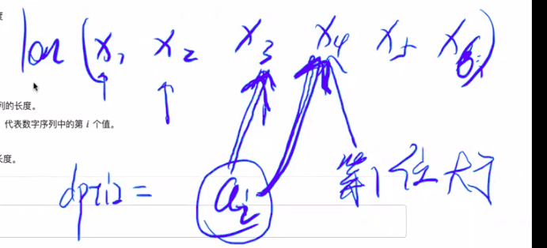

[TOC]

## 目录：

[递归深搜广搜](#递归深搜广搜)

[贪心](#贪心)

[枚举](#枚举)

[二分](#二分)

[单调队列](#单调队列)

[单调栈](#单调栈)

[背包](#背包)

[动态规划](#动态规划)


## 递归深搜广搜

#### #`83.N分`

[题目](http://oj.haizeix.com/problem/83)

**题解:**

层数是固定的，后面的数是>=前面的数，输出方法总数；

每一层从谁开始，选多少数，还应该选几个；


#### #`235.递归实现指数型枚举`

[题目](http://oj.haizeix.com/problem/235)

**题解：**


如果第一层是１那么第二层就应该从２开始，如果第一层是２那么下一层就应该从３开始；
递归函数：func(int s), s是从谁开始
n, num[15]记录，cnt 计数
保证下一层比本层大所以进行func(i + 1)
<font color = red>**他这是每次选择一个，就输出num[];**</font>


#### #`236.递归实现组合型枚举`

[题目](http://oj.haizeix.com/problem/236)

**题解：**

<font color = red>**什么时候能选够ｍ个数就输出num[]**</font>


#### #`237.递归实现排列型枚举`

[题目](http://oj.haizeix.com/problem/237)

**题解：**
后面的数可以比前面数小，与前两个题不同，所以每次遍历要从１～ｎ，为了避免重复，开一个标记组
<font color = red>**也是选择ｍ个数输出num[]，避免重复要标记**</font>
回溯的时候标记别忘取消了；


#### #`240.图形打印四`

[题目](http://oj.haizeix.com/problem/240)

**题解：**


当ｎ= 1时边长为１，当ｎ= 2时边长为３,当ｎ=3时，边长为９，....27...81...243....

可以由左上角对五个位置进行填充，可得

设边长为num[n]

左上角:(`x, y`);

右上角:(`x, y + num[n]/3*2`)

左下角:(`x + num[n]/3*2, y`)

右下角:(`x + num[n]/3*2, y + num[n]/3*2`)

中心：(`x + num[n]/3, y + num[n]/3`)

主要思路是将从１～７个全部打印出来，最后进行选择

当递归到１时将二维字符数组对应的ｘ, y打印成'X'，也就是递归出口；

因为２是由１转变过来的，３是由２转变过来的，４是由３转变过来的，即可递归回溯

#### #`396填涂颜色`

[题目](http://oj.haizeix.com/problem/396)

题解: 可以先在外围加一堵0墙，然后进行对外围搜0，然后都标记为３，最后将全部扫一遍，将０变为２，３变０即可：

>```
>0 0 0 0 0 0
>0 0 1 1 1 1
>0 1 0 0 0 1
>1 0 0 0 0 1
>1 0 0 0 0 1
>1 1 1 1 1 1
>```
>```
>0 0 0 0 0 0 0 0 //先在外围加一堵0墙
>0 0 0 1 1 1 1 0//然后进行对外围搜0，然后都标记为３
>0 0 1 0 0 0 1 0
>0 1 0 0 0 0 1 0
>0 1 0 0 0 0 1 0
>0 1 1 1 1 1 1 0
>0 0 0 0 0 0 0 0
>```
>
>```
>0 0 0 0 0 0//最后将全部扫一遍，将０变为２，３变０即可：
>0 0 1 1 1 1
>0 1 1 2 2 1
>1 1 2 2 2 1
>1 2 2 2 2 1
>1 1 1 1 1 1
>```

#### #`397僵尸来袭`

[题目](http://oj.haizeix.com/problem/397)

题解: 

直接对二维数组遍历，在便利的同时如果非０那就开始搜索，进行吧能搜到的所有僵尸变为０，直至最后，记录了几次调用函数搜索即可！

模拟一下：

```
0 1 2 3 4 0
1 0 0 0 0 0
2 9 3 0 2 4
0 0 2 0 2 8
1 0 0 0 0 0
```

```
0 0 0 0 0 0
1 0 0 0 0 0
2 9 3 0 2 4      第一次
0 0 2 0 2 8
1 0 0 0 0 0
```

```
0 0 0 0 0 0
0 0 0 0 0 0
0 0 0 0 2 4      第二次
0 0 0 0 2 8
1 0 0 0 0 0
```

```
0 0 0 0 0 0
0 0 0 0 0 0
0 0 0 0 0 0      第三次
0 0 0 0 0 0
1 0 0 0 0 0
```

```
0 0 0 0 0 0
0 0 0 0 0 0
0 0 0 0 0 0      第四次
0 0 0 0 0 0
0 0 0 0 0 0
```

#### #`404  01迷宫简易版`

[题目](http://oj.haizeix.com/problem/404)

题解: 

如果上一次坐标与本次坐标不同即可走，然后把标记数组置为１，加数；

此题用到了记录数组；切记刚开始坐标对应的标记数组应该置为一；

#### #`405  01迷宫`

[题目](http://oj.haizeix.com/problem/405)

题解: 

本体由于数量大，按正常思路走会超时，所以本题使用了用队列记录了所要能到达的坐标位置，计数，到一小块结束后，将队列所存的坐标对应全赋值为这一块计数的那个值，继续同理操作，到最后只要索引下表就可以快速找到多大；

#### #`406水坑数量`

[题目](http://oj.haizeix.com/problem/406)

题解: 

本题同３９７僵尸来袭，都是直接遍历二维数组，符合条件就直接搜进行原图标记，记录搜了几波就ＯＫ了；

#### #`534体积`

[题目](http://oj.haizeix.com/problem/534)

题解: 

此题就是235的改进，每走一步记录所走的当前路径的和，然后到最后去重，去重的时候可以使用标记数组，用sun当索引进行标记,记录最后有多少数就是表示不同提及的组合数

#### #`535瓷砖`

[题目](http://oj.haizeix.com/problem/535)

题解: 

直接DFS,先找到开始坐标，进行DFS,能走的地方一直走，每走一步记录一步sum++;最终sum就是最大能走多少；

#### #`536 最大黑色区域`

[题目](http://oj.haizeix.com/problem/536)

题解: 

从头开始走，每当能走时进行搜索记录本次搜索的步数，然后每一波搜索记录一下最大的值，然后就得到最大黑色区域的面积；

#### #`537门票问题`

[题目](http://oj.haizeix.com/problem/537)

题解: 

改进的236题;首先有一个记录路径的，而且还要记录元音和辅音有多少个为了当走了合法left时而且元音辅音符合条件时才能满足打印情况，就是这样。

#### #`538图的遍历`

[题目](http://oj.haizeix.com/problem/538)

已知结点个数，必须整一个标记数组check[], 当没走过的进行遍历周围所能到达的

![Whiteboard[2]-01](%E9%80%92%E5%BD%92%E4%B8%8EDFS.assets/Whiteboard%5B2%5D-01.png)

```c
void func(int x) {
    if(flag == 1) {
        cout << "-";
    }
    flag = 1;
    cout << x;
    for(int i = 1; i <= n; i++) {
        if(num[x][i] == 1 && check[i] == 0) {
            check[i] = 1;
            func(i);
        }
    }
}
```

#### #`540生日购物`

[题目](http://oj.haizeix.com/problem/540)

由于题目N <= 40, 最大40由于很大,达到2 ^ 40多；会超时，因此将其分为两部分进行处理，一部分0 ~ 20 ,21~40进行处理；和235题近似

 

#### #`541相遇问题`

[题目](http://oj.haizeix.com/problem/541)

对于每个人来讲，把他走到ｎ号点的时间都存起来，最后会得到两个人的数组，找两个数组中是否有一样的；邻接矩阵进行存储；

```c
        cin >> a >> b >> c >> d;
        atime[0][a][b] = atime[0][b][a] = c;
        atime[1][a][b] = atime[1][b][a] = d;
```

```c
int n, m, atime[2][20][20], ans[2][100000], ans_num[2];
//atime 存时间, ans存到达所需要的时间，ans_num计数
void func(int people, int locate, int cost) {
    if(locate == n) {
        ans[people][ans_num[people]] = cost;
        ans_num[people]++;
        return;
    }
    for(int i = locate + 1; i <= n; i++) {
        if(atime[people][locate][i]) {
            func(people, i, cost + atime[people][locate][i]);
        }
    }
}
```


#### #`542奶酪`

[题目](http://oj.haizeix.com/problem/542)


求上下表面数组：

```c
 cin >>qiu[i][0] >> qiu[i][1] >> qiu[i][2];
            if(qiu[i][2] <= r) {
                low[low_num++] = i;
            }
            if(qiu[i][2] + r >= h) {
                up[i] = 1;
            }
```

构建邻接矩阵：

```c
  for(int j = 1; j < i; j++) {
                int t0 = qiu[i][0] - qiu[j][0];
                int t1 = qiu[i][1] - qiu[j][1];
                int t2 = qiu[i][2] - qiu[j][2];
                if(sqrt(t0 * t0 + t1 * t1 + t2 * t2) <= 2 * r) {
                    arr[i][j] = arr[j][i] = 1;
                }
            }
```

遍历下表面进行搜索

```c
    for(int i = 0; i <= low_num; i++) {
            if(check[i] == 0) {
                check[i] = 1;
                if(dfs(i)) {
                    cout << "Yes" << endl;
                flag = 1;
                    break;
                }
            }
        }
```

dfs函数：

```c

int dfs(int now) {
    if(up[now] == 1) return 1;
    for(int i = 1; i <= n; i++) {
        if(arr[now][i] && check[i] == 0) {
            check[i] = 1;
            if(func(i)) return 1;
        }
    }
    return 0;
}
```


#### #`81小明回家`

[题目](http://oj.haizeix.com/problem/81)


#### #`303 矩阵距离一`

[题目](http://oj.haizeix.com/problem/303)


#### #`304骑士风度的牛`

[题目](http://oj.haizeix.com/problem/304)


#### #`305 乳草的入侵`

[题目](http://oj.haizeix.com/problem/305)


#### #`398马的遍历 `

[题目](http://oj.haizeix.com/problem/398)


#### #`527飞跃原野`

[题目](http://oj.haizeix.com/problem/527)


#### #`529龙与虫`

[题目](http://oj.haizeix.com/problem/529)

## 贪心

#### [#508两人过河](http://oj.haizeix.com/problem/508)


```cpp
#include<iostream>
#include<cstdio>
#include<cmath>
#include<cstring>
#include<iomanip>
#include<algorithm>
#include<map>
#include<vector>
using namespace std;

int n, num[1002], ans;

int main() {
    ios::sync_with_stdio(false);
    cin >> n;
    for(int i = 0; i < n; i++) {
        cin >> num[i];
    }
    sort(num, num + n);
    for(int i = n - 1; i >= 0; i-=2) {
        if(i == 0) { //１２３直接求解,   大于等于４
            ans += num[0];
            break;
        }
        if(i == 1) {
            ans += num[1];
            break;
        }
        if(i == 2) {
            ans += num[0] + num[1] + num[2];
            break;
        }
        ans += min(num[1] + num[0] + num[i] + num[1], num[i] + num[0] + num[i - 1] + num[0]);
    }
    cout << ans << endl;
    return 0;
}
```


## 枚举

#### [#593魔法项链](http://oj.haizeix.com/problem/593)


```cpp
#include<iostream>
#include<cstdio>
#include<cmath>
#include<cstring>
#include<iomanip>
#include<algorithm>
#include<map>
#include<vector>
using namespace std;
int n, m, ans[30005], mem[30005];
char str[30005];

int main() {
    cin >> n >> m >> &str[1];
    for(int i = 1; i <= n / 2; i++) {//计算从1开始的
        int same = 0;
        for(int j = 1, k = i + 1; j <= i; j++, k++) {
            if(str[j] == str[k]) {
                same++;
            }
        }
        ans[same]++;
        for(int j = 2; j + 2 * i - 1 <= n; j++) {//计算从2开始的
            if(str[j - 1] == str[j - 1 + i]) {
                same--;
            }
            if(str[j + i - 1] == str[j + 2 * i - 1]) {
                same++;
            }
            ans[same]++;
        }
        mem[i] = same;
    }
    for(int i = 0; i < m; i++) {//m次操作
        int t;
        cin >> t;
        if(t == 2) {//ｔ为2时输出答案
            cin >> t;
            cout << ans[t] << endl;
            continue;
        }
        char l;
        cin >> l;//新加入一个字符
        str[++n] = l;
        if(n % 2 == 0) {//若加入后的长度为偶数，则计算新长度子串
            int same = 0, mid = n / 2;
            for(int j = 1, k = 1 + mid; j <= mid; j++, k++) {
                if(str[j] == str[k]) {
                    same ++;
                }
            }
            ans[same] ++;
            mem[mid] = same;
        }
        for(int j = 1; j <= (n - 1) / 2; j++) {//将之前所有长度最后状态取出，向后移动
            if(str[n - j - j] == str[n - j]) {
                mem[j] --;
            }
            if(str[n] == str[n - j]){
                mem[j] ++;
            }
        ans[mem[j]]++;    
        }
    }
    return 0;
}
```

## 二分

#### [#242最大平均值](http://oj.haizeix.com/problem/242)

知识准备：

前缀和和差分数组


正解: 二分答案

check函数实现


b序列的区间和

则长度大于等于什么的一段大于等于0


## 单调队列

```cpp
#include<iostream>
#include<cstdio>
#include<cmath>
#include<cstring>
#include<iomanip>
#include<algorithm>
#include<map>
#include<vector>
using namespace std;
#define MAX_N 300000
int a[MAX_N + 5];
int q[MAX_N + 5], head = 0, tail = 0;
//下标索引值，q存储下标
/*
int main() {
    int n, k;
    cin >> n >> k;
    for(int i = 1; i <= n; i++) cin >> a[i];
    for(int i = 1; i < k; i++) {//先往单调队列中放入k-1个元素
        while(tail - head && a[q[tail - 1]] >= a[i]) tail --;//判断末尾大于等于，违反，踢了
        q[tail++] = i;//当前入队列
    }
    for(int i = k; i <= n; i++) {
        while(tail - head && a[q[tail - 1]] >= a[i]) tail --;
        q[tail++] = i;        
        if(q[head] <= i - k) head ++;
        i == k || cout << " ";
        cout << a[q[head]];
    }
    cout << endl;
    head = tail = 0;
    for(int i = 1; i < k; i++) {
        while(tail - head && a[q[tail - 1]] <= a[i]) tail --;
        q[tail++] = i;
    }
    for(int i = k; i <= n; i++) {
        while(tail - head && a[q[tail - 1]] <= a[i]) tail --;
        q[tail++] = i;
        if(q[head] <= i - k) head ++;
        i == k || cout << " ";
        cout << a[q[head]];
    }
    cout << endl;
    return 0;
}
*/

int main() {
    int n, k;
    cin >> n >> k;
    for(int i = 1; i <= n; i++) cin >> a[i];//a数组存储序列，q数组存储单调队列
    for(int i = 1; i <= n; i++) {
        while(tail - head && a[q[tail - 1]] >= a[i]) tail --; //维护单调性
        q[tail++] = i;
        if(q[head] <= i - k) head ++;//已出队列
        if(i < k)continue;
        i == k || cout << " ";
        cout << a[q[head]];//头部存最小的
    }
    cout << endl;
    head = tail = 0;
    for(int i = 1; i <= n; i++) {
        while(tail - head && a[q[tail - 1]] <= a[i]) tail --;
        q[tail++] = i;
        if(q[head] <= i - k) head ++;
        if(i < k) continue;
        i == k || cout << " ";
        cout << a[q[head]];
    }
    cout << endl;
    return 0;
}
```

## 单调栈

```cpp
#include<iostream>
#include<cstdio>
#include<cmath>
#include<cstring>
#include<iomanip>
#include<algorithm>
#include<map>
#include<vector>
using namespace std;

#define MAX_N 100000
typedef long long inti;
inti a[MAX_N + 5];
inti s[MAX_N + 5], top = -1; 
inti l[MAX_N + 5], r[MAX_N + 5];

int main() {
    inti n;
    cin >> n;
    for(inti i = 1; i <= n; i++) cin >> a[i];
    a[0] =a[n + 1]= -1;
    s[top = 0] = 0;
    for(inti i = 1; i <= n; i++) {
        while(a[s[top]] >= a[i]) -- top;
        l[i] = s[top];
        s[++top] = i;
    }
    s[top = 0] = n + 1;
    for(inti i = n; i >= 1; i--) {
        while(a[s[top]] >= a[i]) -- top;
        r[i] = s[top];
        s[++top] = i;
    }
    inti ans = 0;
    for(inti i = 1; i <= n; i++) {
         ans = max(ans, a[i] * (r[i] - l[i] - 1));
    }
    cout << ans<< endl;
    return 0;
}

```

## 背包

### 0-1背包

问题描述：有n件物品和容量为m的背包 给出i件物品的重量以及价值 求解让装入背包的物品重量不超过背包容量 且价值最大 。 <font color = red>特点:这是最简单的背包问题，特点是每个物品只有一件供你选择放还是不放。</font>


```cpp
/*************************************************************************
	> File Name: 47-01背包.cpp
	> Author:fangsong
	> Mail: 
	> Created Time: 2020年04月22日 星期三 20时10分19秒
 ************************************************************************/
/*
#include<iostream>
#include<cstdio>
#include<cmath>
#include<cstring>
#include<iomanip>
#include<algorithm>
#include<map>
#include<vector>
using namespace std;

int all, n, w[105], v[105], ans[105][100005];

int main() {
    cin >> all >> n;
    for(int i = 1; i <= n; i++) {
        cin >>w[i] >> v[i];
    }
    for(int i = 1; i <= n; i++) {
        for(int j = 1; j <= all; j++) {
            if(j < w[i]) {
                ans[i][j] = ans[i - 1][j];
            } else {
                ans[i][j] = max(ans[i - 1][j], v[i] + ans[i - 1][j - w[i]]);
            }
        }
    }
    cout << ans[n][all] << endl;
    return 0;
}
*/
#include<iostream>
#include<cstdio>
using namespace std;

int all, n, w[102], v[102], ans[10002];

int main() {
    ios::sync_with_stdio(false);
    cin >> all >> n;
    for(int i = 1; i <= n; i++) {
        cin >>w[i] >> v[i];
    }
    for(int i = 1; i <= n; i++) {
        for(int j = all; j >= w[i]; j--) {
                ans[j] = max(ans[j], v[i] + ans[j - w[i]]);
        }
    }
    cout << ans[all] << endl;
    return 0;
}
```

### 完全背包

问题描述：有n件物品和容量为m的背包 给出i件物品的重量以及价值 求解让装入背包的物品重量不超过背包容量 且价值最大 。 <font color = red>特点：题干看似与01一样 但它的特点是每个物品可以无限选用。</font>


```cpp
/*************************************************************************
	> File Name: 48-完全背包.cpp
	> Author:fangsong
	> Mail: 
	> Created Time: 2020年04月22日 星期三 20时53分30秒
 ************************************************************************/
/*
#include<iostream>
#include<cstdio>
#include<cmath>
#include<cstring>
#include<iomanip>
#include<algorithm>
#include<map>
#include<vector>
using namespace std;

int all, n, w[105], v[105], ans[105][100005];

int main() {
    cin >> n >> all;
    for(int i = 1; i <= n; i++) {
        cin >>w[i] >> v[i];
    }
    for(int i = 1; i <= n; i++) {
        for(int j = 1; j <= all; j++) {
            if(j < w[i]) {
                ans[i][j] = ans[i - 1][j];
            } else {
                ans[i][j] = max(ans[i - 1][j], v[i] + ans[i][j - w[i]]);
            }
        }
    }
    cout << ans[n][all] << endl;
    return 0;
}
*/

#include<iostream>
#include<cstdio>
using namespace std;

int all, n, w[10002], v[10002], ans[10002];

int main() {
    ios::sync_with_stdio(false);
    cin >> n >> all;
    for(int i = 1; i <= n; i++) {
        cin >>w[i] >> v[i];
    }
    for(int i = 1; i <= n; i++) {
        for(int j = w[i]; j <= all; j++) {
                ans[j] = max(ans[j], v[i] + ans[j - w[i]]);
        }
    }
    cout << ans[all] << endl;
    return 0;
}

```

### 多重背包

问题描述：有n件物品和容量为m的背包 给出i件物品的重量以及价值 还有数量 求解让装入背包的物品重量不超过背包容量 且价值最大 。

<font color = red>特点 ：它与0 / 1背包有类似点 特点是每个物品都有了一定的数量。该类型题可以转化为0/1类型 .</font>

未优化:


```cpp
#include<iostream>
#include<cstdio>
#include<cmath>
#include<cstring>
#include<iomanip>
#include<algorithm>
#include<map>
#include<vector>
using namespace std;

int all, n, ind ,v[100005], w[100005], ans[100000];
int main() {
    cin >> all >> n;
    for(int i = 0; i < n; i++) {
        int x, y ,z ;
        cin >> x >> y >> z;
        for(int j = 0; j < z; j++) {
            ind ++;
            w[ind] = x;
            v[ind] = y;
        }
    }
    for(int i = 1; i <= ind; i++) {
        for(int j = all; j >= w[i]; j--) {
            ans[j] = max(ans[j], ans[j - w[i]] + v[i]);
        }
    }
    cout << ans[all] << endl;
    return 0;
}
```

把多重背包中的数量为n的物品安二进制分解成物品转化为0/1类型。重量，单价都会改变。如下图：


优化:

```cpp
/*************************************************************************
	> File Name: 49-1-多重背包.cpp
	> Author:fangsong
	> Mail: 
	> Created Time: 2020年04月29日 星期三 19时59分30秒
 ************************************************************************/

#include<iostream>
#include<cstdio>
#include<cmath>
#include<cstring>
#include<iomanip>
#include<algorithm>
#include<map>
#include<vector>
using namespace std;

int all, n, ind ,v[100005], w[100005], ans[100000];
int t[20];
int main() {
    int tt= 1;
    for(int i = 0; i < 20; i++) {//存二进制数据的数组
        t[i] = tt;
        tt *= 2;
    }
    cin >> all >> n;
    for(int i = 0; i < n; i++) {
        int x, y ,z , temp = 0;
        cin >> x >> y >> z;
        while(z > 0) {// 多重背包按二进制分解成0/1背包
            ind ++;
            if(z >= t[temp]) {
                w[ind] = x * t[temp];
                v[ind] = y * t[temp];
                z-= t[temp];
            } else {
                w[ind] = x * z;
                v[ind] = y * z;
                z = 0;
            }
            temp ++;
        }
    }
    for(int i = 1; i <= ind; i++) {//01背包
        for(int j = all; j >= w[i]; j--) {
            ans[j] = max(ans[j], ans[j - w[i]] + v[i]);
        }
    }
    cout << ans[all] << endl;
    return 0;
}
```

## 动态规划

### 动态规划的解题步骤

1、确定动归状态

例如: f(i, j) 代表从底边走到(i, j) 点能获得的最大值

2、确定状态转移方程

例如: 
$$
f(i, j) = max[f(i + 1, j), f(i + 1, j + 1)] + val(i, j);
$$
3、正确性证明:数学归纳法

#### 求解方向


我从哪里来:


我到哪里去:

### 经典问题

#### **1.[最长上升子序列](http://oj.haizeix.com/problem/44)**


(1)确定动归状态
$$
f(i)代表以i作为结尾的长度
$$
(2)确定状态转移方程


$$
f(i) = max(f(j)) + 1 
$$
$$
val(i) > val(j)
$$

(3)代码实现：

**没有优化:**

```cpp
#include<iostream>
using namespace std;
#define max_n 1000000
int dp[max_n + 5], a[max_n + 5];
int main() {
    int n, ans = 0;
    cin >> n;
    for(int i = 1; i <= n; i++) {
        cin >> a[i];
        dp[i] = 1;
    }
    for(int i = 1; i <= n; i++) {
        for(int j = 1; j <= i; j++) {
            if(a[j] >= a[i])continue;
            dp[i] = max(dp[i], dp[j] + 1);
        }
        ans = max(ans, dp[i]);
    }
    cout << ans << endl;
    return 0;
}
```

这种方式效率较低，进而进行优化－－>

**优化：**

1. 在i之前没有必要把所有的遍历一遍，只要在前面找到一个，长度为４例如以6 8 12 16结尾长度为4的，如果不能接到6后面，后面也不要看了，所以我们只要记录相应长度序列末尾最小值是多少

2. 有一个数组len[]记录的是每一种长度的序列末尾最小值

   

   len[]性质：一定是单调的，从小到大

3. 找到最后一位小于a[i]的位置（二分查找）

4. a[i]去更新替换

```cpp
#include<iostream>
#include<cstdio>
#include<cmath>
#include<cstring>
#include<iomanip>
#include<algorithm>
#include<map>
#include<vector>
using namespace std;
#define MAX_N 1000000
int dp[MAX_N + 5];//以第ｉ位作为结尾的最长上升子序列长度
int a[MAX_N + 5];//最长上升子序列低i位的值
int len[MAX_N + 5], ans = 0;//记录的是每一种长度的序列末尾最小值,ans是len中记录的数量
int bs(int *arr, int l, int r, int x) {
    if(l ==  r) return l;
    int mid = (l + r) >> 1;
    if(arr[mid] < x) return bs(arr, mid + 1, r, x);
    return bs(arr, l, mid, x);
}
int main(){
    int n;
    cin >> n;
    for(int i = 1; i <= n; i++) {
        cin >> a[i];
        dp[i] = 1;//形成最短的１
        len[i] = 0x3f3f3f3f;
    }
    len[++ans] = a[1];//len[1] = a[1];

    for(int i = 2; i <= n; i++) {
        dp[i] = bs(len, 1, ans + 1, a[i]);//len中找到第一位大于等于a[i]的值
        len[dp[i]] = a[i];//a[i]去更新，dp[i]相应的长度
        ans = max(dp[i], ans);//在所有的长度中找出一个最大值
    }
    cout << ans << endl;//长度种类是哪种
    return 0;
}
```

#### 2.[最长公共子序列](http://oj.haizeix.com/problem/45)


**(1)确定动归状态**
$$
dp[i][j]
$$
​         第一个字符串选前i位，第二个字符串选前j位所能形成的公共子序列长度,不一定以第ｉｊ结尾；

**(2)确定状态转移方程**
$$
如果第i位与第j位不相等,可以看成没有第i位dp[i - 1][j], dp[i][j - 1]
$$

$$
如果第i位与第j位相等,可以看成他俩都没dp[i - 1][j - 1] + 1, 其中1就是i,j位匹配的
$$


```cpp
/*************************************************************************
	> File Name: 45-最长公共子序列.cpp
	> Author:fangsong
	> Mail: 
	> Created Time: 2020年04月30日 星期四 20时14分14秒
 ************************************************************************/

#include<iostream>
#include<cstdio>
#include<cmath>
#include<cstring>
#include<iomanip>
#include<algorithm>
#include<map>
#include<vector>
using namespace std;
#define MAX_N 1000
int dp[MAX_N +5][MAX_N +5];//第一个字符串选前i位，第二个字符串选前j位所能形成的公共子序列长度
string s1, s2;
int main() {
    cin >> s1 >> s2;
    for(int i = 1; i <= s1.size(); i++) {//字符串下表是从０开始的
        for(int j = 1; j<= s2.size(); j++) {
            dp[i][j] = max(dp[i - 1][j], dp[i][j - 1]);//第i位与第j位不相等
            if(s1[i - 1] - s2[j - 1])continue;
            dp[i][j] = dp[i - 1][j - 1] + 1;//第i位与第j位相等
        }
    }
    cout << dp[s1.size()][s2.size()] << endl;
    return 0;
}
```

#### 3.最长公共上升子序列


**(1)确定动归状态**
$$
f[i][j]表示以b[j]结尾，字符串a[i]之前的公共上升子序列的最大长度
$$
**(2)确定状态转移方程**
$$
f[i][j] >= f[i - 1][j]
$$

$$
若a[i]!=b[j]: f[i][j] = f[i - 1][j]
$$

$$
若a[i] == b[j]: f[i][j] = max(f[k][j]) + 1; (1 <= k <=j - 1 并且 b[j] > b[k])
$$


#### #[50-扔鸡蛋](http://oj.haizeix.com/problem/50)


基础做法：


```cpp
#include<iostream>
#include<cstdio>
#include<cmath>
#include<cstring>
#include<iomanip>
#include<algorithm>
#include<map>
#include<vector>
using namespace std;
#define MAX_N 32
#define MAX_M 65536
long long dp[MAX_N + 5][MAX_M+ 5];

int main() {
    int n, m;
    cin >> n >> m;
    
    for(int i = 1; i <= n; i++) {
        for(int j = 1; j <= m; j++) {
            if(i == 1) {
                dp[i][j] = j;
                continue;
            }
            dp[i][j] = j;
            for(int k = 1; k <= j; k++){
                dp[i][j] = min(dp[i][j], max(dp[i - 1][k], dp[i][j - k]) + 1);
            }
        }
    }
    cout << dp[n][m] - 1 << endl;
    return 0;
}
```

优化：n个鸡蛋扔ｋ次最多能测m层楼


```cpp
#include<iostream>
#include<cstdio>
#include<cmath>
#include<cstring>
#include<iomanip>
#include<algorithm>
#include<map>
#include<vector>
using namespace std;
#define MAX_N 32
#define MAX_M 65536
long long dp[MAX_N + 5][MAX_M+ 5];

int main() {
    long long n, m;
    cin >> n >> m;
    if(n == 1) {
        cout << m << endl;
        return 0;
    }
    for(long long k = 1; k <= MAX_M; k++) dp[1][k] = k;
    for(long long i = 2; i <= n; i++) {
        for(long long k = 1; k <= MAX_M; k++) {
            dp[i][k] = dp[i - 1][k - 1] + dp[i][k - 1] + 1;
        }
    }
    long long p = 1;
    while(dp[n][p] < m) {
        p++;
    }
    cout << p << endl;
    return 0;
}
```

