[TOC]


   * [EP01 - 3和5的倍数（等差数列）](#ep01---3和5的倍数等差数列)
   * [EP02 - 斐波那契数（滚动数组）](#ep02---斐波那契数滚动数组)
   * [EP03-最大素数 (消除合数)](#ep03-最大素数-消除合数)
   * [EP04-最大的回文数 (任意进制)](#ep04-最大的回文数-任意进制)
   * [EP06-平方和差（公式推导）](#ep06-平方和差公式推导)
   * [EP28-数螺旋对角线（改进平方和公式）](#ep28-数螺旋对角线改进平方和公式)
   * [EP30-数字五次幂（如何求上限）](#ep30-数字五次幂如何求上限)
   * [EP34-数字阶乘（如何求上限）](#ep34-数字阶乘如何求上限)
   * [EP05-最小公倍数（欧几里得证明）](#ep05-最小公倍数欧几里得证明)
   * [EP08- 系列中最大的产品(滑动窗口)](#ep08--系列中最大的产品滑动窗口)
   * [EP10 -  素数求和（线性筛）](#ep10----素数求和线性筛)
   * [EP11-网格中最大的产品(方向数组)](#ep11-网格中最大的产品方向数组)
   * [EP14-最长的Collatz序列(记忆化)](#ep14-最长的collatz序列记忆化)
   * [EP17-数字字母计数](#ep17-数字字母计数)
   * [EP13-大整数加法](#ep13-大整数加法)
      * [ａ^ b](#ａ-b)
      * [高精度乘法](#高精度乘法)
      * [高精度阶乘](#高精度阶乘)
   * [EP25-1000位斐波纳契数(高精度＆滚动数组)](#ep25-1000位斐波纳契数高精度滚动数组)
   * [EP31-硬币总和(递推)](#ep31-硬币总和递推)
   * [EP32-Pandigital产品](#ep32-pandigital产品)
   * [EP38-全数字的倍数](#ep38-全数字的倍数)
   * [EP44-五边形数](#ep44-五边形数)
   * [EP09-<strong>特殊毕达哥拉斯三元组</strong>(素勾股数)](#ep09-特殊毕达哥拉斯三元组素勾股数)
   * [EP12-高度可约的三角形数（求整数因子个数）](#ep12-高度可约的三角形数求整数因子个数)
   * [EP-15 晶格路径（求组合数，一乘一除）](#ep-15-晶格路径求组合数一乘一除)
   * [EP-16功率数字总和（高精度幂）](#ep-16功率数字总和高精度幂)
   * [EP-18 最大路径和 （动态规划）](#ep-18-最大路径和-动态规划)
   * [EP-24<strong>字典序排列</strong>（全排列）](#ep-24字典序排列全排列)
   * [EP-26倒数的循环节(最大的循环节)](#ep-26倒数的循环节最大的循环节)
   * [EP29-<strong>不同的幂</strong>(大整数幂＆比较大小)](#ep29-不同的幂大整数幂比较大小)
   * [EP-39整个边长直角三角形(素勾股数)](#ep-39整个边长直角三角形素勾股数)
   * [EP-47不同的素数因子](#ep-47不同的素数因子)
   * [<strong>EP-21亲和数</strong>](#ep-21亲和数)
* [小项(练习)](#小项练习)
   * [阶乘分解素数](#阶乘分解素数)


## EP01 - 3和5的倍数（等差数列）

> 如果我们列出10以内所有3或5的倍数，我们将得到3、5、6和9，这些数的和是23。
>
> 求1000以内所有3或5的倍数的和。

```cpp
#include<iostream>
#include<cstdio>
#include<cmath>
#include<cstring>
#include<iomanip>
#include<algorithm>
#include<map>
#include<vector>
using namespace std;
/*
int is_val(int n) {
    if(n % 3 == 0 || n % 5 == 0)return 1;
    return 0;
}
int main() {
    int  sum = 0;
    for(int i = 1; i < 1000; i++) {
        if(!is_val(i))continue;
        sum += i;
        
    }
    printf("%d\n", sum);
    return 0;
}
*/

int main() { //等差数列
    int sum3 = (3 + 999) * 333 / 2;
    int sum5 = (5 + 995) * (995 / 5) / 2;
    int sum15 = (15 + (999 / 15) * 15) * (999 / 15) /2;
    printf("%d\n", sum3 + sum5 - sum15);
}
```

## EP02 - 斐波那契数（滚动数组）

> 斐波那契数列中的每个新项都是通过将前两个项相加而生成的。从1和2开始，前10个术语将是：
> 1，2，3，5，8，13，21，34，55，89，...
> 通过考虑斐波那契数列中值不超过四百万的项，找到偶值项的总和。

| 0    | 1      | 2    |
| ---- | ------ | ---- |
| 1    | 2      | 3    |
| 5    | 8      | 13   |
| 21   | ...... |      |

```cpp
#include<iostream>
#include<cstdio>
#include<cmath>
#include<cstring>
#include<iomanip>
#include<algorithm>
#include<map>
#include<vector>
/*
#define max_n 44
using namespace std;
int fib[max_n + 5];
#define N 4000000

int main() {
    fib[1] = 1, fib[2] = 2;
    int sum = 2;
    for (int i = 3; i <= max_n && (fib[i - 1] + fib[i - 2] <= N); i++) {
        fib[i] = fib[i - 1] + fib[i - 2];
        if(fib[i] & 1)continue;
        sum += fib[i];
    }
    cout << sum << endl;
    return 0;
}
*/
/*
#define N 4000000
int main() {
    int sum = 0, n=1;
    int a = 0, b = 1, c;
    while(a + b <= N) {
        n += 1;
        b = a + b;
        a = b - a;
        if(b&1) continue;
        sum+=b;
    }
    printf("%d %d\n",n, sum);
    return 0;
}
*/
#define N 4000000
int main() {
    int f[3] = {0, 1};
    int sum = 0, n = 2;
    while(f[(n - 1) % 3] + f[(n - 2) % 3] <= N) {
        f[n % 3] = f[(n - 1) % 3] + f[(n - 2) % 3];
        if(!(f[n % 3] & 1)) sum += f[n%3];
        n += 1;
    }
    printf("%d\n", sum);
    return 0;
}
```

## EP03-最大素数 (消除合数)

> 13195的主要因子是5、7、13和29。
> 什么是600851475143的最大素数？

```cpp
#include<iostream>
#include<cstdio>
#include<cmath>
#include<cstring>
#include<iomanip>
#include<algorithm>
#include<map>
#include<vector>

#define N 600851475143LL

using namespace std;


int main() {
    long long ans = 0, M = N;
    long long i = 2;
    while(i * i <= M) {
        if(M % i == 0)ans = i; //ans一定是素因子
        while(M % i == 0)M /= i;
        i += 1;
    }
    if(M > 1)ans = M;
    return 0;
}
```


## EP04-最大的回文数 (任意进制)

> 回文数在两个方向上都相同。由两个两位数的乘积构成的最大回文数为9009 = 91×99。
> 查找由两个3位数字的乘积组成的最大回文。

```cpp
#include<iostream>
#include<cstdio>
#include<cmath>
#include<cstring>
#include<iomanip>
#include<algorithm>
#include<map>
#include<vector>
using namespace std;

int is_val(int n, int base) {   //base是任意进制数
    int x = n, temp = 0;
    while(x) {
        temp = temp * base + x % base;
        x /= base;
    }
    return temp == n;
}

int main() {
    int ans = 0;
    for(int i = 100; i <= 999; i++) {
        for(int j = i; j <= 999; j++) {
            if(is_val(i * j, 10) &&i * j > ans ) ans = i * j;
        }
    }
    printf("%d\n", ans);
    return 0;
}
```


## EP06-平方和差（公式推导）

```cpp

```


**平方和推导公式**：

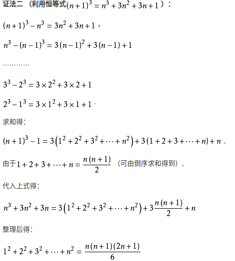

如果推导四次方和，类似；


## EP28-数螺旋对角线（改进平方和公式）

> 从数字1开始，沿顺时针方向向右移动，形成了5 x 5的螺旋，如下所示：
>
> **21** 22 23 24 **25**
> 20  **7** 8  **9** 10
> 19 6  **1** 2 11
> 18  **5** 4  **3** 12
> **17** 16 15 14 **13**
>
> 可以验证对角线上的数字之和为101。
>
> 以相同方式形成的1001 x 1001螺旋中的对角线上的数字的总和是多少？


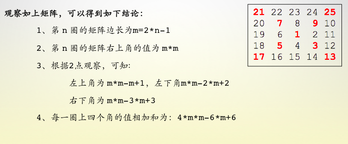

```cpp
#include<iostream>
#include<cstdio>
#include<cmath>
#include<cstring>
#include<iomanip>
#include<algorithm>
#include<map>
#include<vector>
using namespace std;
int main() {
    int sum = 1;
    for(int l = 3; l <= 1001; l += 2) {
        sum += 4 * l * l - 6 * l + 6;
    }
    // sum = 4(3^2 + 5^2 + 7^2 + .. + 1001^2) - 6(3 + 5 + 7 + ... ) + C
    //平方和与n项和公式
    printf("%d\n", sum);
    return 0;
}
```

## EP30-数字五次幂（如何求上限）

令人惊讶的是，只有三个数字可以写成它们的数字的四次幂之和：

> 1634 = 1 4 + 6 4 + 3 4 + 4 4
> 8208 = 8 4 + 2 4 + 0 4 + 8 4
> 9474 = 9 4 + 4 4 + 7 4 + 4 4

由于1 = 1 4不是总和，因此不包括在内。

这些数字的总和为1634 + 8208 + 9474 = 19316。

查找所有可以写为数字的五次幂之和的数字之和。

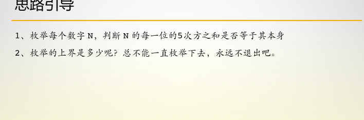

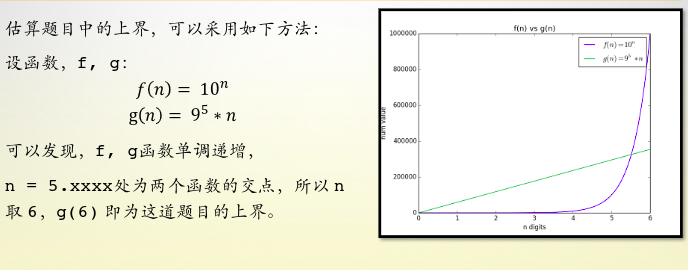

```cpp
#include<iostream>
#include<cstdio>
#include<cmath>
#include<cstring>
#include<iomanip>
#include<algorithm>
#include<map>
#include<vector>
using namespace std;

#define max_n 354294
int is_val(int n) {
    int x = n, tmp = 0;
    while(x) {
        tmp += (int)pow(x % 10, 5);
        x/=10;
    }
    return tmp == n;
}
int main() {
    int sum = 0;
    for(int i = 2; i <= max_n; i++) {
        if(is_val(i))sum += i;
    }
    printf("%d\n",sum);
    return 0;
}
```

```cpp
#!/usr/bin/env python
# coding=utf-8
import numpy as np
import matplotlib.pyplot as plt

 

plt.figure(1) # 创建图表1
x = np.linspace(0, 6, 300) # 在0--6范围之间，生成300个点
y1 = [10**z for z in x]    # 得到 f(n) 函数的 y 值数组
y2 = [(9**5)*z for z in x] # 得到 g(n) 函数的 y 值数组


plt.figure(1)
plt.title('f(n) vs g(n)')
p1 = plt.plot(x, y1, label="$f(n)=10^n$");
p2 = plt.plot(x, y2, label="$g(n)=9^5 * n$");
plt.xlabel('n digits')
plt.ylabel('num value')

plt.legend() # 显示图例

plt.show() # 显示图表
```

## EP34-数字阶乘（如何求上限）

> 145是一个奇数，等于1！+ 4！+ 5！= 1 + 24 + 120 = 145。
>
> 查找所有数字的总和，这些数字等于其数字的阶乘之和。

注意：为1！= 1和2！= 2不是总和，不包括在内。

求其上限： `n * (9 * 8 * 7 * 6 * 5 * 4 * 3 * 2 * 1) =10 ^(n - 1) `

八位

n = 8，所以 8  *（9 * 8 * 7 * 6 * 5 * 4 * 3 * 2 * 1）= 2903040 

```cpp
#include<iostream>
#include<cstdio>
#include<cmath>
#include<cstring>
#include<iomanip>
#include<algorithm>
#include<map>
#include<vector>
using namespace std;
int f(int n) {
    if(n == 0) return 1;
    return n * f(n - 1);
}
/*记忆化搜索
int keep[10] = {0};
int f(int n) {
    if(keep[n])return keep[n];
    if(n == 0) return 1;
    return keep[n] = n * f(n - 1);
}
*/
int w(int n) {
    int x = n, temp = 0;
    while(x) {
        temp += f(x % 10);
        x /= 10;
    }
    return n == temp;
}
int main() {
    int sum = 0;
    for(int i = 3; i <= 2903040; i+=2) {
        if(w(i)) {
            sum += i;
        }
    }
    cout << sum << endl;
    return 0;
}
```

## EP05-最小公倍数（欧几里得证明）

> 2520是可以除以1到10的每个数字而没有任何余数的最小数字。
>
> 能被1到20的所有数均分的最小正数是多少？
>
> 

```cpp
#include<iostream>
#include<cstdio>
#include<cmath>
#include<cstring>
#include<iomanip>
#include<algorithm>
#include<map>
#include<vector>
using namespace std;
int gcd(int a, int b) {
    return (b ? gcd(b, a % b) : a);
}
int main() {
    int ans = 1;
    for(int i = 1; i <= 20; i++) {
        if(ans % i == 0) continue;
        ans *= i / gcd(ans, i);
    }
    cout << ans << endl;
    return 0;
}
```

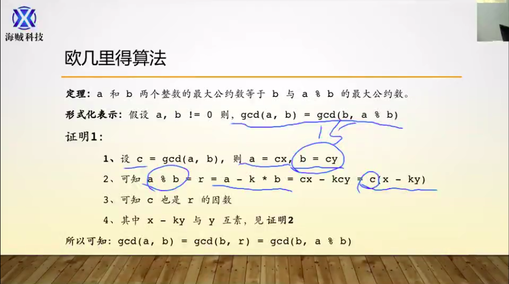

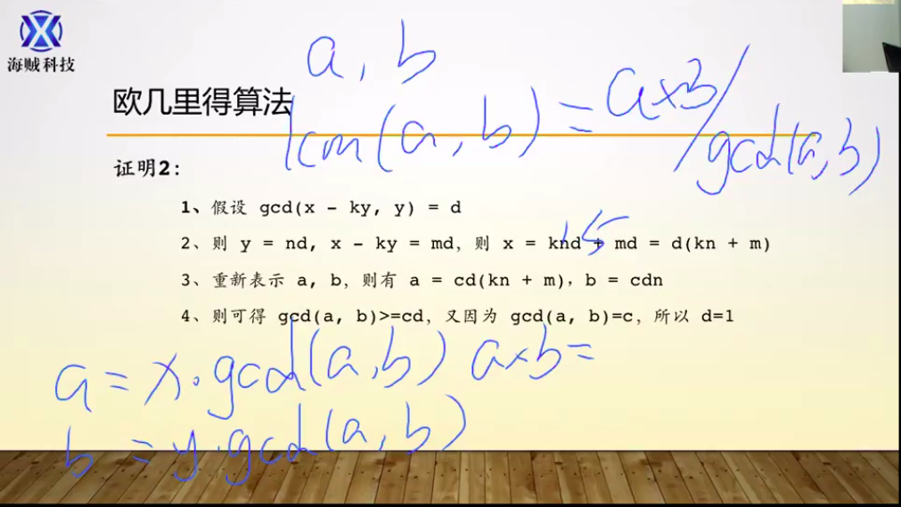


##　EP07-素数/线性筛（线性筛推理）


素数筛：

```cpp
#include<iostream>
#include<cstdio>
#include<cmath>
#include<cstring>
#include<iomanip>
#include<algorithm>
#include<map>
#include<vector>
using namespace std;
#include<inttypes.h>
#define max_n 200000
int prime[max_n + 5] = {0};

void init() {
    for(int64_t i = 2; i * i <= max_n; i++) {
        if(prime[i])continue;
        for(int64_t j = i * i; j <= max_n; j += i) {
            prime[j] = 1;
        }
    }
    for(int i = 2; i <= max_n; i++) {
        if(!prime[i])prime[++prime[0]] = i;
    }
    return;
}

int main() {
    init();
    cout << prime[10001]<< endl;
    return 0;
}
```


线性筛：

> 筛选前30素数：
>
> ２　３　４　５　６　７　８　９　１０　１１　１２　１３　１４　１５　１６　１７　１８　１９　２０　２１　２２　２３　２４　２５　２６　２７　２８　２９　３０
>
> 先从２开始往后筛，把４筛掉
>
> ２　３　'4 '　５　６　７　８　９　１０　１１　１２　１３　１４　１５　１６　１７　１８　１９　２０　２１　２２　２３　２４　２５　２６　２７　２８　２９　３０
>
> 然后从３开始往后筛，把６，９筛掉
>
> ２　３　'4 '　５　'6'　７　８　'9'　１０　１１　１２　１３　１４　１５　１６　１７　１８　１９　２０　２１　２２　２３　２４　２５　２６　２７　２８　２９　３０
>
> 然后从４开始往后筛，把８筛掉
>
> ２　３　'4 '　５　'6'　７　'8'　'9'　１０　１１　１２　１３　１４　１５　１６　１７　１８　１９　２０　２１　２２　２３　２４　２５　２６　２７　２８　２９　３０
>
> 然后从５开始往后筛，把１０，１５，２５筛掉
>
> ２　３　'4 '　５　'6'　７　'8'　'9'　'１０'　１１　１２　１３　１４　'１５'　１６　１７　１８　１９　２０　２１　２２　２３　２４　'２５'　２６　２７　２８　２９　３０
>
> ......
>
> 一直晒到最后
>
> ２　３　'4 '　５　'6'　７　'8'　'9'　'１０'　１１　'１２'　１３　'１４'　'１５'　'１６'　１７　'１８'　１９　'２０'　'２１'　'２２'　２３　'２４'　'２５'　'２６'     '２７'    '２８'   ２９　'３０'

```cpp
#define max_n 200000
int prime[max_n + 5] = {0};

void init() {
    for(int i = 2; i <= max_n; i++) {
        if(!prime[i]) prime[++prime[0]] = i;
        for(int j = 1; j <= prime[0]; j++) {
            if(prime[j] * i > max_n) break;
            prime[prime[j] * i] = 1;
            if(i % prime[j] == 0) break; // 9 * 3 = 27, 9 * 4就不行了
        }
    }
}
int main(){
    init();
    cout << prime[10001] << endl;
    return 0;
}
```

##  EP08- 系列中最大的产品(滑动窗口)


>The four adjacent digits in the 1000-digit number that have the greatest product are 9 × 9 × 8 × 9 = 5832.
>
>73167176531330624919225119674426574742355349194934
>96983520312774506326239578318016984801869478851843
>85861560789112949495459501737958331952853208805511
>12540698747158523863050715693290963295227443043557
>66896648950445244523161731856403098711121722383113
>62229893423380308135336276614282806444486645238749
>30358907296290491560440772390713810515859307960866
>70172427121883998797908792274921901699720888093776
>65727333001053367881220235421809751254540594752243
>52584907711670556013604839586446706324415722155397
>53697817977846174064955149290862569321978468622482
>83972241375657056057490261407972968652414535100474
>82166370484403199890008895243450658541227588666881
>16427171479924442928230863465674813919123162824586
>17866458359124566529476545682848912883142607690042
>24219022671055626321111109370544217506941658960408
>07198403850962455444362981230987879927244284909188
>84580156166097919133875499200524063689912560717606
>05886116467109405077541002256983155200055935729725
>71636269561882670428252483600823257530420752963450
>
>Find the thirteen adjacent digits in the 1000-digit number that have the greatest product. What is the value of this product?

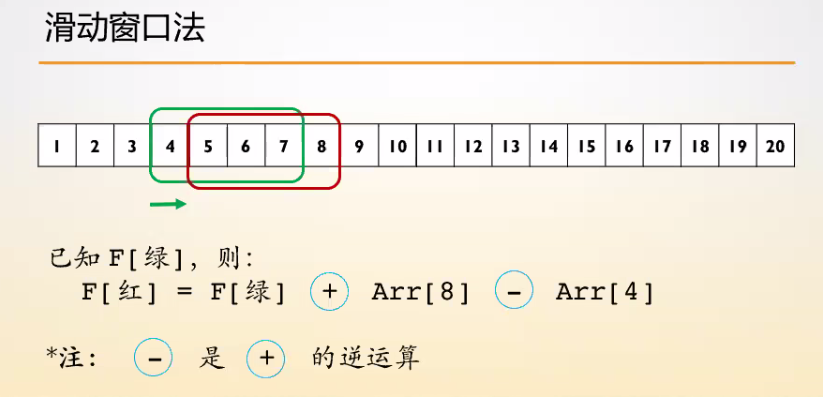

逆运算："-"是"+"的逆运算，但"+"不是"-"的逆运算

input_08

```cpp
73167176531330624919225119674426574742355349194934
96983520312774506326239578318016984801869478851843
85861560789112949495459501737958331952853208805511
12540698747158523863050715693290963295227443043557
66896648950445244523161731856403098711121722383113
62229893423380308135336276614282806444486645238749
30358907296290491560440772390713810515859307960866
70172427121883998797908792274921901699720888093776
65727333001053367881220235421809751254540594752243
52584907711670556013604839586446706324415722155397
53697817977846174064955149290862569321978468622482
83972241375657056057490261407972968652414535100474
82166370484403199890008895243450658541227588666881
16427171479924442928230863465674813919123162824586
17866458359124566529476545682848912883142607690042
24219022671055626321111109370544217506941658960408
07198403850962455444362981230987879927244284909188
84580156166097919133875499200524063689912560717606
05886116467109405077541002256983155200055935729725
71636269561882670428252483600823257530420752963450
```

cpp:

```cpp
#define max_n 1000
char num[max_n + 5]; 
int main() {
    int len = 0;
    while(~scanf("%s", num + len))len += strlen(num + len); 
    //逐渐读入
    long long int ans = 0, p = 1, zero = 0;
    for(int i = 0; num[i]; i++) {
        num[i] -= '0';
        if(num[i]) {
            p *= num[i];
        } else zero ++;
        if(i < 13)continue;
        if(num[i - 13]) p /= num[i - 13];
        else zero -= 1;
        if(zero == 0 && p > ans)ans = p;
    }
    printf("%lld\n",ans);
    return 0;
}
```

使用：`./a.out < input_8`

## EP10 -  素数求和（线性筛）

>低于10的素数之和为2 + 3 + 5 + 7 = 17。
>
>找出200万以下的所有素数之和。

```cpp
#include<iostream>
#include<cstdio>
#include<cmath>
#include<cstring>
#include<iomanip>
#include<algorithm>
#include<map>
#include<vector>
using namespace std;
#define max_n 2000000
int prime[max_n];
int main() {
    long long int sum = 0;
    for(int i = 2; i <= max_n; i++) {
        if(!prime[i]) {
            prime[++prime[0]] = i;
            sum += i;
        }
        for(int j = 1; j <= prime[0]; j++) {
            if(prime[j] * i > max_n)break;
            prime[i * prime[j]] = 1;
            if(i % prime[j] == 0)break;
        }
    }
    cout << sum << endl;
    return 0;
}
```

## EP11-网格中最大的产品(方向数组)

>在下面的20×20网格中，沿对角线的四个数字用红色标记。
>
>08 02 22 97 38 15 00 40 00 75 04 05 07 78 52 12 50 77 91 08
>49 49 99 40 17 81 18 57 60 87 17 40 98 43 69 48 04 56 62 00
>81 49 31 73 55 79 14 29 93 71 40 67 53 88 30 03 49 13 36 65
>52 70 95 23 04 60 11 42 69 24 68 56 01 32 56 71 37 02 36 91
>22 31 16 71 51 67 63 89 41 92 36 54 22 40 40 28 66 33 13 80
>24 47 32 60 99 03 45 02 44 75 33 53 78 36 84 20 35 17 12 50
>32 98 81 28 64 23 67 10 <font color = red>26</font> 38 40 67 59 54 70 66 18 38 64 70
>67 26 20 68 02 62 12 20 95 <font color = red>*63*</font> 94 39 63 08 40 91 66 49 94 21
>24 55 58 05 66 73 99 26 97 17 <font color = red>*78*</font> 78 96 83 14 88 34 89 63 72
>21 36 23 09 75 00 76 44 20 45 35 <font color = red>*14*</font> 00 61 33 97 34 31 33 95
>78 17 53 28 22 75 31 67 15 94 03 80 04 62 16 14 09 53 56 92
>16 39 05 42 96 35 31 47 55 58 88 24 00 17 54 24 36 29 85 57
>86 56 00 48 35 71 89 07 05 44 44 37 44 60 21 58 51 54 17 58
>19 80 81 68 05 94 47 69 28 73 92 13 86 52 17 77 04 89 55 40
>04 52 08 83 97 35 99 16 07 97 57 32 16 26 26 79 33 27 98 66
>88 36 68 87 57 62 20 72 03 46 33 67 46 55 12 32 63 93 53 69
>04 42 16 73 38 25 39 11 24 94 72 18 08 46 29 32 40 62 76 36
>20 69 36 41 72 30 23 88 34 62 99 69 82 67 59 85 74 04 36 16
>20 73 35 29 78 31 90 01 74 31 49 71 48 86 81 16 23 57 05 54
>01 70 54 71 83 51 54 69 16 92 33 48 61 43 52 01 89 19 67 48
>
>这些数字的乘积为26×63×78×14 = 1788696。
>
>在20×20网格中，相同方向（上，下，左，右或对角线）上四个相邻数字的最大乘积是多少？

只要四个方向就能遍历完：

```cpp

#include<iostream>
#define max_n 20
int grid[max_n + 5][max_n + 5];
int dir[4][2] = {
    {-1, -1},{ -1, 0},{ -1, 1},{ 0, 1}   //只要四个方向就能遍历完
};
int calc(int x, int y) {
    int ans = 0;
    for(int k = 0; k < 4; k ++) {
        int p = 1;
        for(int step = 0; step < 4; step ++) {
            int dx = x + dir[k][0] * step;
            int dy = y + dir[k][1] * step;
        if(dx < 0 || dx >= max_n)break;
        if(dy < 0 || dy >= max_n)break;
        p *= grid[dx][dy];
        }
        if(p > ans)ans = p;
    }
    return ans;
}
int main() {
    for(int i = 0; i < max_n; i++) {
        for(int j = 0; j < max_n; j++) {
            scanf("%d", &grid[i][j]);
        }
    }
    int ans = 0;
    for(int i = 0;i < max_n; i++) {
        for(int j = 0; j < max_n; j++) {
            int p = calc(i, j);
            if(p > ans) ans = p;
        }
    }
    printf("%d\n", ans);
    return 0;
}
```

## EP14-最长的Collatz序列(记忆化)

>为正整数的集合定义了以下迭代序列：
>
>n → n / 2（n是偶数）
>n →3 n + 1（n是奇数）
>
>使用上面的规则并从13开始，我们生成以下序列：
>
>13→40→20→10→5→16→8→4→2→1
>
>可以看出，该序列（从13开始到1结束）包含10个项。尽管尚未证明（Collatz问题），但可以认为所有起始数字都以1结尾。
>
>最长的链条, 小于100万的哪个起始数字？
>
>**注意：**链条启动后，期限就可以超过一百万。


朴素做法

```cpp
#include<iostream>
#include<cstdio>
#include<cmath>
#include<cstring>
#include<iomanip>
#include<algorithm>
#include<map>
#include<vector>
using namespace std;
#define max_n 1000000

typedef long long ll;

ll get_len(ll n) {
    if(n == 1)return 1;
    //if(n < 0)printf("ERROR\n");
    if(n % 2 == 0) return get_len(n / 2) + 1;
    return get_len(3 * n + 1) + 1;
}
int main() {
    ll ans = 0, len = 0;
    for(int i = 1; i < max_n; i++) {
        ll tmp = get_len(i);
        if(tmp > len) {
            ans = i;
            len = tmp;
        }
    }
    printf("num = %lld, len = %lld\n", ans, len);
    return 0;
}
```

记忆化：

```cpp
#include<iostream>
#include<cstdio>
#include<cmath>
#include<cstring>
#include<iomanip>
#include<algorithm>
#include<map>
#include<vector>
using namespace std;
#define max_n 1000000
#define size  1000000

typedef long long ll;
ll keep[max_n + 5] = {0};

ll get_len(ll n) {
    if(n == 1)return 1;
    //if(n < 0)printf("ERROR\n");
    if(n <= max_n && keep[n]) return keep[n];
    ll ret = 0;
    if(n % 2 == 0) ret = get_len(n / 2) + 1;
    else ret =  get_len(3 * n + 1) + 1;
    if(n <= max_n)keep[n] = ret;
    return ret;
}
int main() {
    ll ans = 0, len = 0;
    for(int i = 1; i < max_n; i++) {
        ll tmp = get_len(i);
        if(tmp > len) {
            ans = i;
            len = tmp;
        }
    }
    printf("num = %lld, len = %lld\n", ans, len);
    return 0;
}
```


## EP17-数字字母计数

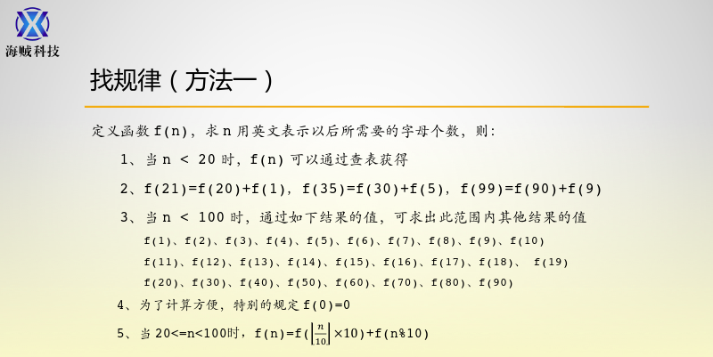

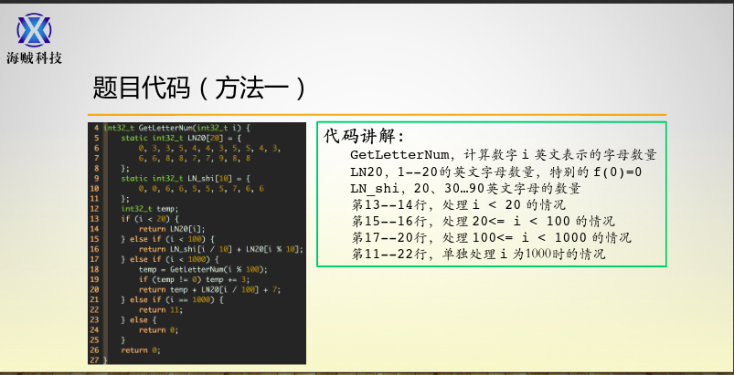

```cpp
#include<iostream>
#include<cstdio>
#include<cmath>
#include<cstring>
#include<iomanip>
#include<algorithm>
#include<map>
#include<vector>
using namespace std;
int get_letters(int n) {
   static int arr1[20] = {
        0, 3, 3, 5, 4, 4, 3, 5, 5, 4, 3,
        6, 6, 8, 8, 7, 7, 9, 8, 8 
    };
   static int arr2[10] = {
        0, 0, 6, 6, 5, 5, 5, 7, 6, 6
    };
    if(n < 20) {
        return arr1[n];
    } else if(n < 100){
        return arr2[n / 10] + arr1[n % 10];
    } else if(n < 1000) {
        if(n % 100 == 0) return arr1[n / 100] + 7;
        return arr1[n / 100] + 10 + get_letters(n % 100);
    } else {
       return 11;
    }
}
int main() {
    int sum = 0;
    for(int i = 1; i <= 1000; i++) {
        sum += get_letters(i);
    }
    printf("%d\n", sum);
    return 0;
}
```

## EP13-大整数加法

```cpp
#include<iostream>
#include<cstdio>
#include<cmath>
#include<cstring>
#include<iomanip>
#include<algorithm>
#include<map>
#include<vector>
using namespace std;
#include<string.h>
#define max_n 52

char str[max_n + 5] = {0};
int ans[max_n + 5] = {0};

int main() {

    while(~scanf("%s", str)) {
        int len = strlen(str);
        if(len > ans[0]) ans[0] = len;
        for(int i = 0; i < len; i++) {
            ans[len - i] += str[i] - '0';
        }
        for(int i = 1; i <= ans[0]; i++) {
            if(ans[i] < 10)continue;
            ans[i + 1] += ans[i] / 10;
            ans[i] %= 10;
            ans[0] += (i == ans[0]);
        }
    }
    for(int i = ans[0]; i > ans[0] - 10; i--) {
        printf("%d", ans[i]);
    }
    return 0;
}
```

### ａ^ b

```cpp
#include<iostream>
#include<cstdio>
#include<cmath>
#include<cstring>
#include<iomanip>
#include<algorithm>
#include<map>
#include<vector>
using namespace std;
#define max_n 500
void solve (int a, int b){
    int ans[max_n] = {0};
    ans[0] = 1, ans[1] = 1;
    for(int i = 0; i < b; i++) {
        for(int j = 1; j <= ans[0]; j++) {
            ans[j] *= a;
        }
        for(int k = 1; k <= ans[0]; k++) {
            if(ans[k] < 10)continue;
            ans[k + 1] += ans[k] / 10;
            ans[k] %= 10;
            ans[0] += (ans[0] == k);
        }
    }
    for(int i = ans[0]; i > 0; i--) {
        printf("%d", ans[i]);
    }
    cout << endl;
}
int main() {
    int a, b;
    cin >> a >> b;
    solve(a, b);
    return 0;
}
```

### 高精度乘法

```cpp
#include<iostream>
#include<cstdio>
#include<cmath>
#include<cstring>
#include<iomanip>
#include<algorithm>
#include<map>
#include<vector>
using namespace std;
#define max_n 100
char str_a[max_n + 5], str_b[max_n + 5];
int a[max_n + 5], b[max_n + 5], c[2 * max_n + 5];
int main() {
    memset(c, 0, sizeof(c));
    cin >> str_a >> str_b;
    int len_a = strlen(str_a);
    int len_b = strlen(str_b);
    for(int i = 0; i < len_a; i++)a[i] = str_a[len_a - i - 1] - '0';
    for(int i = 0; i < len_b; i++)b[i] = str_b[len_b - i - 1] - '0';
    for(int i = 0; i < len_a; i ++) {
        for(int j = 0; j < len_b; j++) {
            c[i + j] += a[i] * b[j];
            if(c[i + j] < 10)continue;
            c[i + j + 1] += c[i + j] / 10;
            c[i + j] %= 10;
        }
    }
    int len_c = len_a + len_b;
    while(!c[len_c])len_c--;
    for(int i = len_c; i >= 0; i--) {
        cout << c[i];
    }
    cout << endl;
    
    return 0;
}
```

### 高精度阶乘

```cpp
#define max_n 1500
int ans[max_n + 5];
int res[max_n + 5];
void solve(int x) {
    memset(ans, 0, sizeof(ans));
    ans[0] = 1, ans[1] = 1;
    for(int i = 1; i <= x; i++) {
        for(int j = 1; j <= ans[0]; j++) {
            ans[j] *= i;
        }
        for(int k = 1; k <= ans[0]; k++) {
            if(ans[k] < 10)continue;
            ans[k + 1] += ans[k] / 10;
            ans[k] %= 10;
            ans[0] += (ans[0] == k);
        }
    }
    memset(res, 0, sizeof(res));
    res[0] = 1, res[1] = 1;
    for(int i = 1; i <= ans[0]; i++) {
        if(!ans[i])continue;
        for(int j = 1; j <= res[0]; j++) {
            res[j] *= ans[i];
        }
        for(int k = 1; k <= res[0]; k++) {
            if(res[k] < 10)continue;
            res[k + 1] += res[k] / 10;
            res[k] %= 10;
            res[0] += (res[0] == k);
        }
    }
    for(int i = res[0]; i > 0; i--) {
        cout << res[i];
    }
    cout << endl;
}

int main() {
    int n;
    while(scanf("%d", &n)!=EOF) {
        solve(n);
    }
    return 0;
}
```

## EP25-1000位斐波纳契数(高精度＆滚动数组)

斐波那契数列由递归关系定义：

> F *n* = F *n* -1 + F *n* -2，其中F 1 = 1和F 2 = 1。

因此，前12个术语将是：

> F 1 = 1
> F 2 = 1
> F 3 = 2
> F 4 = 3
> F 5 = 5
> F 6 = 8
> F 7 = 13
> F 8 = 21
> F 9 = 34
> F 10 = 55
> F 11 = 89
> F 12 = 144

第12个项F 12是包含三个数字的第一个项。

斐波纳契数列中包含1000个数字的第一项的索引是什么？

```cpp
#include <stdio.h>

int f[3][1005]; //开１５００防止底下数炸了b[0] 有可能大于

int main() {
    int n = 2;
    f[1][0] = 1;　// [0]存的是几位的数
    f[1][1] = 1;　
    f[2][0] = 1;
    f[2][1] = 1;
    while (f[n%3][0] < 1000) {  
        n += 1;        
        int *a = f[n % 3], *b = f[(n-1)%3], *c = f[(n- 2) % 3]; //存的每一位上数的大小
        for(int i = 1; i <= b[0]; i++) {
            a[i] = b[i] + c[i]; // 对应的位相加得到的数存在ａ[]中
        }
        a[0] = b[0];
        for(int i = 1; i <= a[0]; i++) {　// 判断ａ[]的进位，　进位后，进行一轮判断a[0]是否等于1000
            if(a[i] < 10)continue;
            a[i + 1] += a[i] / 10;
            a[i] %= 10;
            a[0] += (i == a[0]);
        }
    }
    printf("%d\n", n);
    return 0;
}
/*
f[0],  f[1],  f[2]
   a        c        b
   2         1       1
   c         a       b
    3        2        1
    c         b       a
    2         1        3
*/
```

## EP31-硬币总和(递推)

在英国，货币由英镑（£）和便士（p）组成。一般发行的硬币有八种：

> 1p，2p，5p，10p，20p，50p，£1（100p）和£2（200p）。

可以通过以下方式赚取£2：

> 1×£1 + 1×50p + 2×20p + 1×5p + 1×2p + 3×1p

可以使用任意数量的硬币来制作2英镑几种不同的方式？

```cpp
#include<iostream>
#include<cstdio>
#include<cmath>
#include<cstring>
#include<iomanip>
#include<algorithm>
#include<map>
#include<vector>
using namespace std;

#define max_n 8
#define max_m 200

int f[max_n + 5][max_m + 5];
int w[max_n + 5] = {
    1, 2, 5, 10, 20, 50, 100, 200
};
int main() {
    for(int i = 0; i < max_n; i++) { // 前ｉ中
        f[i][0] = 1;　// 初始化前ｉ种组成０元所需要的种数初始化为１，以便后面链接使用
        for(int j = 1; j <= max_m; j++) {　// 控制ｊ块钱
          f[i][j] = 0;　// 初始化前 i 种组成 j 块钱种数为０ 
          if(i >= 1)f[i][j] += f[i - 1][j]; //前i - 1种硬币组成ｊ块钱所种数 
          if(j >= w[i])  f[i][j] += f[i][j - w[i]];　// 前ｉ- 1种硬币加上前 i 种组成 j - w[i]块钱所得的种数
        }
    }
    return 0;
}

// 滚动数组法
#define max_n 8
#define max_m 200

int f[2][max_m + 5];
int w[max_n + 5] = {
    1, 2, 5, 10, 20, 50, 100, 200
};
int main() {
    for(int k = 0; k < max_n; k++) {
        int i = k % 2;　//表示所存的哪一位　
        f[i][0] = 1;　// 初始化 i 种所要组成的钱数０，所为１
        for(int j = 1; j <= max_m; j++) {　// ｊ为所要组成的钱数
          f[i][j] = 0;　// 初始化 前ｉ种所组成的ｊ的个数为０
          f[i][j] += f[i ^ 1][j];  // 前i - 1项所组成ｊ元钱所需要的种数
          if(j >= w[k])  f[i][j] += f[i][j - w[k]];　// 前 i - 1项所加上前ｉ项所组成的总种类
        }
    }
    printf("%d\n", f[(max_n - 1) % 2][max_m]);
    return 0;
}

// 二维降一维：前面所有的ｉ可以省略掉
int main() {
    f[0] = 1; // 组成０元时所种类
    for(int i = 0; i < max_n; i++) {　//遍历一遍前ｉ项
        for(int j = 1; j <= max_n; j++) { // 遍历一遍没组成的每一元钱
            if(j >= w[i])f[j] +=f[j - w[i]];
        }
    }
    printf("%d\n", f[max_n]);
    return 0;
}
/*
int main() {
    for(int i = 0; i < max_n; i++) {
        f[i][0] = 1;
        for(int j = 1; j <= max_m; j++) {
            f[i][j] = 0;
            if(i >= 1) f[i][j] = f[i][j] + f[i - 1][j];
            if(j >= w[i])f[i][j] = f[i - 1][j] + f[i][j - w[i]];
        }
    }
}

int main() {
    f[0] = 1;
    for(int i = 0; i < max_n; i++) {
        for(int j = 1; j <= max_n; j++) {
            if(j >= w[i])f[j] += f[j - w[i]];
        }
    }
    return 0;
}*/

```

## EP32-Pandigital产品

```cpp
我们可以说，如果n位数字恰好一次使用了1到n的所有数字，那么它就是pandigital 。例如，5位数字15234是1到5个泛数字。

乘积7254是不寻常的，因为其标识为39×186 = 7254，包含被乘数，乘数，乘积是1到9泛数。

找出所有被乘数/乘数/产品标识可以写成1到9泛数字的所有产品的总和。

提示：某些产品可以通过多种方式获得，因此请确保只在其总和中包含一次。
```

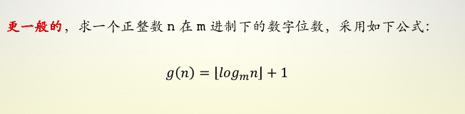

```cpp
#include<iostream>
#include<cstdio>
#include<cmath>
#include<cstring>
#include<iomanip>
#include<algorithm>
#include<map>
#include<vector>
using namespace std;
#define max_n 10000
int add_to_num(int *num, int n) { // 表示在nuｍ数组中对num[0~9]做标记，如果有重的，就返回０
    while(n) {
        if(num[n % 10])return 0;
        num[n%10] += 1;
        n/=10;
    }
    return 1;
}
int dights(int a) {
    if(a == 0)return 1;
    else {
        return floor(log10(a)) + 1;
    }
}
int val(int a, int b) {
    if(dights(a) + dights(b) + dights(a * b) - 9)return 0;　// a, b, c　三个数的位数和为９
    int num[10] = {0};　
    int flag = 1;
    num[0] = 1;
    flag = flag && add_to_num(num, a);　// 如果有一个为０，那么最后返回０
    flag = flag && add_to_num(num, b);
    flag = flag && add_to_num(num, a * b);
    return flag;
}
int keep[max_n + 5] = {0};
int main() {
    int sum = 0;
    for(int a = 1; a < 100; a ++ ) {　// a  1... 100 
        for(int b = a + 1; b < 10000; b ++) { // b > a
            if(!val(a , b))continue; // 如果ａ，ｂ满足条件
            if(keep[a * b])continue;　// 标记只有一次
            sum += a * b;
            keep[a * b] = 1;
            printf("%d * %d = %d\n", a , b, a * b);
        }
    }
    printf("%d\n", sum);
    return 0;
}
```

## EP38-全数字的倍数

将192分别与1、2、3相乘：

> 192 × 1 = 192
> 192 × 2 = 384
> 192 × 3 = 576

连接这些乘积，我们得到一个1至9全数字的数192384576。我们称192384576为192和(1,2,3)的连接乘积。

同样地，将9分别与1、2、3、4、5相乘，得到1至9全数字的数918273645，即是9和(1,2,3,4,5)的连接乘积。

对于n > 1，所有某个整数和(1,2, … ,n)的连接乘积所构成的数中，最大的1至9全数字的数是多少？

```cpp
#include <stdio.h>
#include <math.h>

int dights(long long int n) {
    if(n == 0)return 1;
    else return floor(log10(n)) + 1;
}

int calc(int x) {
    long long n = 1, ans = 0;
    while(dights(ans) < 9) {　// 不足９位继续
        ans *= pow(10, dights(x * n)); // 几位
        ans += n * x;　// 每一次乘上ｎ
        n += 1;
    }
    if(dights(ans) - 9) return 0;　// 判断是否为９位数
    int num[10] = {1, 0};　// 因为是１．．．９，不包含０，去掉０
    int tmp = ans;
    while(tmp) {   // 判断ａｎｓ是否包含所有的１．．．．９
        if(num[tmp % 10])return 0;　
        num[tmp % 10] += 1;
        tmp /= 10;
    }
    return ans;
}

int main() {
    long long ans = 0;
    for(int i = 1; i < 10000; i++) {
        int tmp = calc(i);
        if(tmp > ans) ans = tmp;
    }
    printf("%lld\n", ans);
    return 0;
}
```

## EP44-五边形数

五边形数由公式Pn=n(3n−1)/2生成。前十个五边形数是：

1, 5, 12, 22, 35, 51, 70, 92, 117, 145, …

可以看出P4 + P7 = 22 + 70 = 92 = P8。然而，它们的差70 − 22 = 48并不是五边形数。

在所有和差均为五边形数的五边形数对Pj和Pk中，找出使D = |Pk − Pj|最小的一对；此时D的值是多少？

```cpp
#include <stdio.h>
#include <inttypes.h>

typedef long long int1;
int1 Pentagonal(int1 n) {
    return n * (3 * n - 1) / 2;
}
int1 binary_search(int1 (*func)(int1), int1 n, int1 x) {
    int1 head = 1, tail = n, mid;
    while(head <= tail) {
        mid = (head + tail) >> 1;
        if(func(mid) == x) return mid;
        if(func(mid) < x) head = mid + 1;
        else tail = mid - 1;
    }
    return 0;
}
int main() {
    int1 n = 2, D = INT32_MAX, pk, pj; 
    while(Pentagonal(n) - Pentagonal(n - 1) < D) {
        pk = Pentagonal(n);
        for(int1 j = n - 1; j >= 1; j--) {　// 枚举n - 1之前
            pj = Pentagonal(j);　// 取出
            if(pk - pj >= D) break;　// 如果差值 >= D跳出
            int1 ind1 = binary_search(Pentagonal, 2 * n, pk + pj); // 进行二分
            int1 ind2 = binary_search(Pentagonal, n, pk - pj);　// 进行二分
            if(ind2 && ind1) {
                D = pk - pj;
            }
        }
        n ++;
    }
    printf("%lld\n", D);
    return 0;
}
```

## EP09-**特殊毕达哥拉斯三元组**(素勾股数)

毕达哥拉斯三元组是三个自然数a <b <c组成的集合，并满足

a 2 + b 2 = c 2

例如，3 2 + 4 2 = 9 + 16 = 25 = 5 2。

有且只有一个毕达哥拉斯三元组满足a + b + c =1000。求这个三元组的乘积abc。

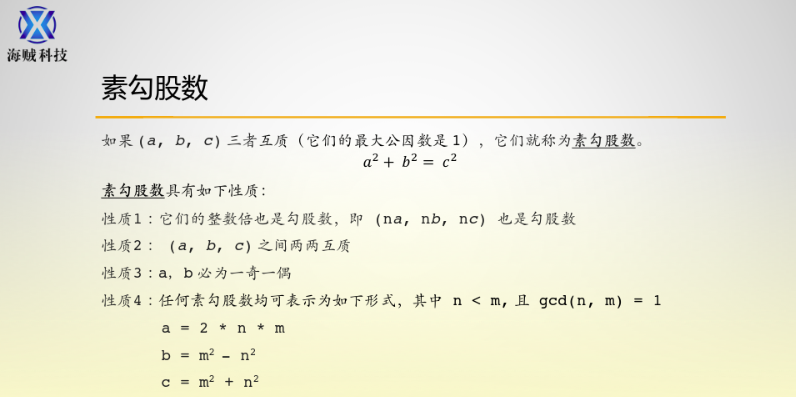

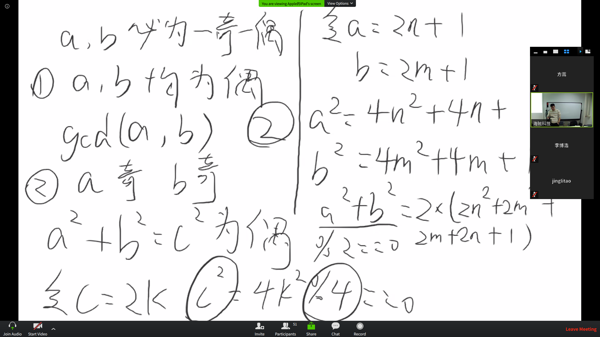

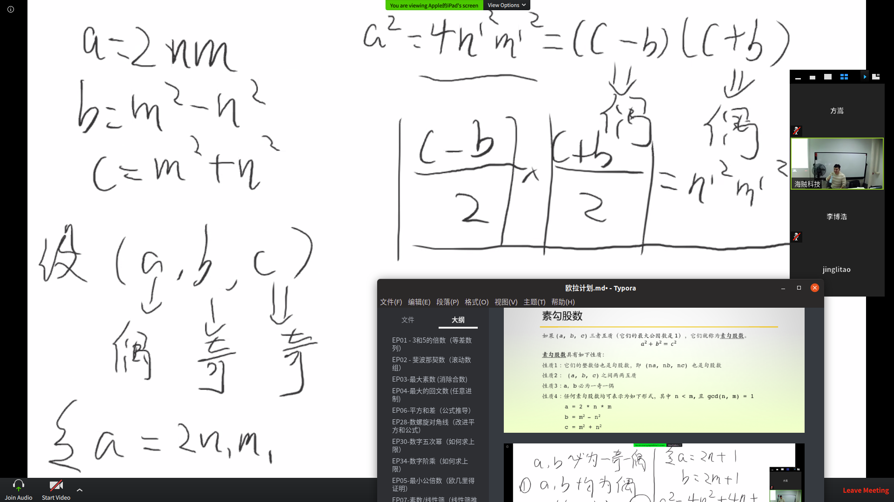

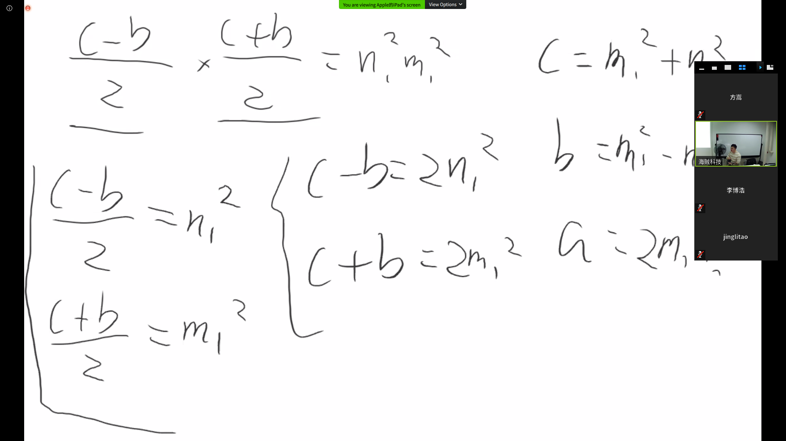

```cpp
#include<iostream>
#include<cstdio>
#include<cmath>
#include<cstring>
#include<iomanip>
#include<algorithm>
#include<map>
#include<vector>
using namespace std;
int gcd(int a, int b) {
    return (b ? gcd(b, a % b) : a );
}
int ans;
int main() {
    for(int n = 1; n <= 33; n++) {
        for(int m = n + 1; m * m + n * n < 1000; m++) {
            if(gcd(m, n) - 1)continue;
            int a = 2 * m * n;
            int b = m * m - n * n;
            int c = m * m + n * n;
            if(1000 % (a + b + c) == 0) {
                int k = 1000 / (a + b + c);
                ans = a * b * c * pow(k , 3);
            }
            if(ans)break;
        }
        if(ans)break;
    }
    cout << ans << endl;

    return 0;
}
```


## EP12-高度可约的三角形数（求整数因子个数）

> 例如，第7个三角形数是1 + 2 + 3 + 4 + 5 + 6 + 7 =28。三角形数列的前十项分别是：
>
> 1，3，6，10，15，21，28，36，45，55，…
>
> 让我们同轴出前七个三角形数的所有约数：
>
>  **1**：1
>  **3**：1,3
>  **6**：1,2,3,6
> **10**：1,2,5,10
> **15**：1,3,5,15
> **21**：1,3,7,21
> **28**：1,2, 4,7,14,28
>
> 我们可以抛光，28是第一个拥有超过5个约数的三角形数。
>
> 第一个拥有超过500个约数的三角形数是多少？

```cpp
#include<iostream>
#include<cstdio>
#include<cmath>
#include<cstring>
#include<iomanip>
#include<algorithm>
#include<map>
#include<vector>
using namespace std;
#define max_n 1000
/*
int f[max_n + 5] = {0};
int prime[max_n + 5] = {0};

void init() {
    for(int i = 2; i <= max_n; i++) {
        if(!prime[i]){ 
            prime[++prime[0]] = i;
            f[i] = 2;
        }
        for(int j = 1; j <= prime[0]; j++) {
            if(i * prime[j] > max_n)break;
            prime[i * prime[j]] = 1;
            if(i % prime[j] == 0) {//bu hu su
                int a = i, cnt = 0;
                while(a % prime[j] == 0)a /= prime[j], cnt ++;
                f[i * prime[j]] = f[i] / (cnt + 1) * (cnt + 2);
                break;
            } else { //hu su
                f[i * prime[j]] = f[prime[j]] * f[i];
            }
        }
    
    }
    return;
}
*/
/*
int main() {
    init();
    int n = 1, fac = 0;
    while(fac < 500) {
        if(n & 1) {
            fac = 
        }
    }


    return 0;
}


#include<iostream>
#include<set>
#include<map>
#include<vector>
#include<algorithm>
using namespace std;
#define max_n 1000

int prime[max_n + 5] = {0};
int f[max_n + 5] = {0};
int cnt[max_n + 5] = {0};

void init() {
    for (int i = 2; i <= max_n; i++) {
        if (!prime[i]) {
            prime[++prime[0]] = i;
            f[i] = 2;
            cnt[i] = 1;
        }
        for (int j = 1; j <= prime[0]; j++) {
            if (prime[j] * i > max_n) break;
            prime[prime[j] * i] = 1;
            if (i % prime[j] == 0) {
                f[i * prime[j]] = f[i] / (cnt[i] + 1) * (cnt[i] + 2);
                cnt[i * prime[j]] = cnt[i] + 1;
                break;
            } else {
                f[prime[j] * i] = f[prime[j]] * f[i];
                cnt[prime[j] * i] = 1 ;
            }
        }
    }
    return ;
}

int main() {
    init();
    for (int i = 2; i <= 100; i++) {
        cout << i << "=" << f[i] << endl;
    }
    return 0;
}
*/

void init() {
    for(int i = 2; i <= max_n; i++) {
        if(!prime[i]) { 
            prime[++prime[0]] = i;
            f[i] = 2;
        }
        for(int j = 1; j <= prime[0]; j++) {
            if(i * prime[j] > max_n) break;
            if(i % prime[j] == 0) {
                int a = i, cnt = 0;
                while(i % prime[j] == 0) {
                    a /= prime[j];
                    cnt ++;
                }
                f[i * prime[j]] = f[i] / (cnt + 1) * (cnt + 2);
                break;
            } else {
                f[i * prime[j]] = f[i] * f[prime[j]];
            }
        }
    }
}
int main() {
    
}
```


## EP-15 晶格路径（求组合数，一乘一除）

从2×2网格的左上角开始，并且只能向右和向下移动，到右下角有6条路线。


通过20×20网格有多少条这样的路线？

```cpp
#include<iostream>
#include<cstdio>
#include<cmath>
#include<cstring>
#include<iomanip>
#include<algorithm>
#include<map>
#include<vector>
using namespace std;
int main() {
    long long  m = 40, n = 20, ans = 1;　// 求
    while(m != 20|| n) {
        if(m != 20 )ans *= (m --);
        if(n != 0 && ans % n == 0) ans  /= (n--);
    }
    cout << ans << endl;
    return 0;
}
```


## EP-16功率数字总和（高精度幂）

2 ^15 = 32768，其位数之和为3 + 2 + 7 + 6 + 8 = 26。

2 ^1000的位数总和是多少？

```cpp
#include<iostream>
#include<cstdio>
#include<cmath>
#include<cstring>
#include<iomanip>
#include<algorithm>
#include<map>
#include<vector>
using namespace std;

#define max_n 400

int ans[max_n + 5] = {1, 1, 0};

int main() {
    for(int i = 1; i <= 100; i++) {
        for(int j = 1; j <= ans[0]; j++) {
            ans[j] *= 1024;
        }
        for(int k = 1; k <= ans[0]; k++) {
            if(ans[k] < 10)continue;
            ans[k + 1] += ans[k] / 10;
            ans[k] %= 10;
            ans[0] += (k == ans[0]);
        }
   }
    int sum = 0;
    for(int i = 1; i <= ans[0]; i++) {
        sum += ans[i];
    }
    cout << sum << endl;
    return 0;
}
```


## EP-18 最大路径和 （动态规划）

> 从下面展示的三角形的顶端出发，不断移动到在下一行与其相邻的元素，能够得到的最大路径和是23。
>
> **3**
> **7** 4
> 2 **4** 6
> 8 5 **9** 3
>
> 如上图，最大路径和为 3 + 7 + 4 + 9 = 23。
>
> 求从下面展示的三角形顶端出发到达底部，所能够得到的最大路径和：
>
> 75
> 95 64
> 17 47 82
> 18 35 87 10
> 20 04 82 47 65
> 19 01 23 75 03 34
> 88 02 77 73 07 63 67
> 99 65 04 28 06 16 70 92
> 41 41 26 56 83 40 80 70 33
> 41 48 72 33 47 32 37 16 94 29
> 53 71 44 65 25 43 91 52 97 51 14
> 70 11 33 28 77 73 17 78 39 68 17 57
> 91 71 52 38 17 14 91 43 58 50 27 29 48
> 63 66 04 68 89 53 67 30 73 16 69 87 40 31
> 04 62 98 27 23 09 70 98 73 93 38 53 60 04 23
>
> **注意：** 在这个问题中，由于只有16384条路径，通过尝试所有的路径来解决问题是可行的。但是，对于[第67题](http://pe-cn.github.io/67)，虽然是一道相同类型的题目，但是三角形将拥有一百行，此时暴力破解将不能解决，而需要一个更加聪明的办法！;o)

```cpp
#include<iostream>
#include<cstdio>
#include<cmath>
#include<cstring>
#include<iomanip>
#include<algorithm>
#include<map>
#include<vector>
using namespace std;

#define max_n 20
int val[max_n][max_n]={0};
int ans[max_n][max_n] = {0};　//记忆化ｄｆｓ
int dfs(int i, int j, int n) {
    if(i + 1 == n)return val[i][j];　// 如果是最后一行
    if(ans[i][j])return ans[i][j];　// 记忆化，如果有使用的值，则可以直接拿来用
    int val1 = dfs(i + 1, j, n);　
    int val2 = dfs(i + 1, j + 1, n);
    return ans[i][j] = (val1 > val2 ? val1 :val2) + val[i][j];
}

int main() {
    for(int i = 0; i < 15; i++) {
        for(int j = 0; j <= i; j++) {
            cin >> val[i][j];
        }
    }
    cout << dfs(0, 0, max_n);
    return 0;
}
```

```cpp
#include <iostream>
using namespace std;
#define max_n 20
int vak[max_n + 5][max_n + 5] = {0};

int main() {
    for(int i = 0; i < max_n; i ++) {
        for(int j = 0; j <= i; j++) {
            cin >> val[i][j];
        }
    }
    for(int max_n - 2; i >= 0; i--) {
        for(int j = 0; j <= i; j++) {
            f[i][j] = max(val[i + 1][j], val[i + 1][j + 1]) + val[i][j]; // 状态转移公式，从下往上推
        }
    }
    cout << f[0][0] << endl;
    return 0;
}

```


## EP-24**字典序排列**（全排列）

> 例如，3124是数字1、2、3、4的一个分开。如果把所有排列按照数字大小或字母先后进行排序，我们称为字典序排列。0、1、2的字典序排列是：
>
> 012 021 102 120 201 210
>
> 数字0、1、2、3、4、5、6、7、8、9的字典序分开中第一百万位的排列是什么？


```cpp
#include<iostream>
#include<cstdio>
#include<cmath>
#include<cstring>
#include<iomanip>
#include<algorithm>
#include<map>
#include<vector>
using namespace std;
#define max_n 10
int fac[max_n]; // 存谁的阶乘
int num[max_n];　// 存一个数是否使用过，如果没使用为１，否则为０

void init(int n) {
    fac[0] = 1;　// 0的阶乘为１
    num[0] = 1;　// 将num[0]初始化为１，因为在下面循环随着１开始的所以这里要初始化num[0] = 1;
    for(int i = 1; i <= n; i++) { //求阶乘
        fac[i] = i * fac[i - 1];　// 从０～ｎ的每个数的阶乘存在数组里打表
        num[i] = 1;　// 将未使用过num[i] 标记为１，
    }
    return;
}
int get_num(int k, int n, int &x) {　// 每次传来ｋ是还需要多少能到所得项，ｎ是每个数的阶乘，ｘ是带回其此位的值
    int step = k / n;　// 需要上升几步
    x = 0;　// 初始化ｘ为０
    for(int t = 0; t <= step; x += (t <= step)) {　// 将ｔ走几步, 只要t <＝step时，意思是还得走
        t += num[x];　// 每次ｔ所加的是没有走过, + 0 || + 1
    }
    k %= n; // k % n = k还需要多少能到达其第几个
    num[x] = 0;//走过的标记为０
    return k;
}
int main() {     
    init(max_n);
    int k = 1000000 - 1;
    for(int i = max_n; i > 0; i --) {
        int x;
        k = get_num(k, fac[i - 1], x);
        cout << x;
    }
    return 0;
}

```

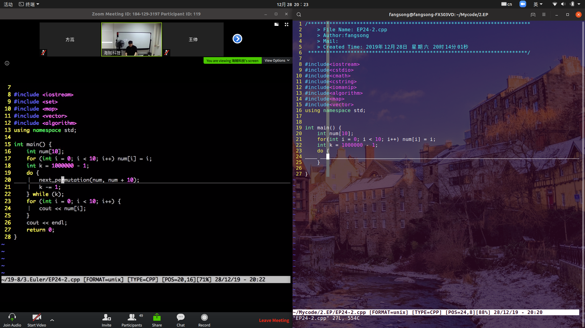


## EP-26倒数的循环节(最大的循环节)

> 单位分数指分子为1的分数。分母为2至10的单位分数的十进制表示如下所示：
>
> 1 / 2 = 0.5
> 1 / 3 = 0（3）
> 1 / 4 = 0.25
> 1 / 5 = 0.2
> 1 / 6 = 0.1（6）
> 1 / 7 = 0。（142857）
> 1 / 8 = 0.125
> 1 / 9 = 0（1）
> 1 / 10 = 0.1
>
> 这里0.1（6）表示0.166666 ...，括号内表示有一个循环节。可以研磨，1 / 7有六位循环节。
>
> 找出正整数d <1000，其倒数的十进制表示小数部分有最大的循环节。

```cpp
#include<iostream>
#include<cstdio>
#include<cmath>
#include<cstring>
#include<iomanip>
#include<algorithm>
#include<map>
#include<vector>
using namespace std;
#define max_n 1000

int r_len[max_n + 5] = {0};

int get_len(int d) {
    memset(r_len, 0, sizeof(r_len));
    int r = 1, t = 1;
    r_len[r] = 1;
    while (d) {
        r *= 10;
        r %= d;
        t += 1;
        if(r_len[r]) return t - r_len[r];
        r_len[r] = t;
    }
    return 0;
}

int main() {
    int d = 0, len = -1;
    for(int i = 2; i <= max_n; i++) {
        int tmp = get_len(i);
        if(len < tmp) {
            len = tmp;
            d = i;
        }
    }

    cout << d << endl;
    cout << len <<endl;
    return 0;
}
```


## EP29-**不同的幂**(大整数幂＆比较大小)

考虑所有满足2≤a≤5和2≤b≤5的整体组合生成的幂a b：

> 2 2 = 4，2 3 = 8，2 4 = 16，2 5 = 32
> 3 2 = 9,3 3 = 27，3 4 = 81，3 5 = 243
> 4 2 = 16，4 3 = 64，4 4 = 256、4 5 = 1024
> 5 2 = 25、5 3 = 125、5 4 = 625、5 5 = 3125

如果把这些幂按照大小排列并去重，我们得到以下由15个不同的项组成的序列：

4，8，9，16，25，27，32，64，81，125，243，256，625，1024，3125

在所有满足2≤a≤100和2≤b≤100的整体组合生成的幂a b分布并去重所得到的序列中，有多少个不同的项？

```cpp
#include<iostream>
#include<cstdio>
#include<cmath>
#include<cstring>
#include<iomanip>
#include<algorithm>
#include<map>
#include<vector>
using namespace std;
#define max_n 10000
#define max_m 210
/*
int result[max_n + 5][max_m];
int result_len = 0;

int find_result(int *num) {
    for(int i = 0; i < result_len; i++) {
        if(memcmp(result + i, num,sizeof(int)*max_m) == 0) {
            return i + 1;
        }
    }
    return 0;
}

int main() {
    for(int a = 2; a <= 100; a++) {
        for(int b = 2; b <= 100; b++) {
            int temp[max_m] = {1, 1, 0};

           for(int i = 0; i < b; i++) {
            for(int j = 1; j <= temp[0]; j++) temp[j] *= a; 
            for(int j = 1; j <= temp[0]; j++) { 
                if(temp[j] < 10) continue;
                temp[j + 1] += temp[j] / 10;
                temp[j] %= 10;
                temp[0] += (temp[0] == j);}
           }
     
            if (find_result(temp) == 0) {
                memcpy(result + result_len, temp, sizeof(int) * max_m);
                result_len += 1;
            }
        }

    }
    cout << result_len<<endl;
    return 0;
}
*/
int *result[max_n + 5];
int result_len = 0;

int find_result(int *num) {
    for(int i = 0; i < result_len; i++) {
        if(memcmp(result[i], num,sizeof(int)*max_m) == 0) {
            return i + 1;
        }
    }
    return 0;
}

int *calc(int a, int b) {
    int *temp = (int *)calloc(sizeof(int), max_m);
    temp[0] = 1, temp[1] = 1;
       for(int i = 0; i < b; i++) {
            for(int j = 1; j <= temp[0]; j++) temp[j] *= a; 
            for(int j = 1; j <= temp[0]; j++) { 
                if(temp[j] < 10) continue;
                temp[j + 1] += temp[j] / 10;
                temp[j] %= 10;
                temp[0] += (temp[0] == j);
            }
       }
    return temp;
}

int main() {
    for(int a = 2; a <= 100; a++) {
        for(int b = 2; b <= 100; b++) {
            int *temp = calc(a , b);
            if (find_result(temp) == 0) {
                result[result_len++] = temp;
            }
        }

    }
    cout << result_len<<endl;
    return 0;
}
```

## EP-39整个边长直角三角形(素勾股数)

若三边长{a，b，c}插入整数的直角三角形周长为p，当p = 120时，恰好存在三个不同的解：

{20,48,52}，{24,45,51}，{30,40,50}

在所有的p≤1000中，p取何值时有解的数目最多？


一个素勾股数的倍数是勾股数

> a = m * m - n * n;
>
> b = 2 *n * m;
>
> c = m * m + n * n;


```cpp
#include<iostream>
#include<cstdio>
#include<cmath>
#include<cstring>
#include<iomanip>
#include<algorithm>
#include<map>
#include<vector>
using namespace std;
#define max_n 1000

int cnt[max_n +5] = {0};

int gcd(int a, int b) {
    return (b ? gcd(b, a % b) : a);
}

int main() {
    for(int n = 1; n <= 32; n++) {
        for(int m = n + 1; m <= 32; m++) {
            if(gcd(n, m) - 1)continue;
            int a = m * m - n * n;
            int b = 2 * m * n;
            int c = m * m + n * n;
            for(int p = a + b + c; p <= 1000; p+= (a + b + c)) {
                cnt[p] += 1;
            }
        }
    }
    int ans = 0;
    for(int i = 1; i <= max_n; i++) {
        if(cnt[i] > cnt[ans])ans = i;
    }
    
    cout << ans << endl;
    return 0;
}
```


## EP-47不同的素数因子

>不同的质因数**
>
>首次出现连续两个数均有两个不同的质因数是在：
>
>14 = 2 × 7
>15 = 3 × 5
>
>首次出现连续三个数均有三个不同的质因数是在：
>
>644 = 22 × 7 × 23
>645 = 3 × 5 × 43
>646 = 2 × 17 × 19
>
>首次出现连续四个数均有四个不同的质因数时，其中的第一个数是多少？

```cpp
#include<iostream>
#include<cstdio>
#include<cmath>
#include<cstring>
#include<iomanip>
#include<algorithm>
#include<map>
#include<vector>
using namespace std;

#define max_n 1000000

int prime[max_n + 5] = {0};

void init() {
    for(int i = 2; i <= max_n; i++) {
        if(prime[i]) continue;
        for(int j = i; j <= max_n; j+=i) {
            prime[j] += 1;
        }
    }
    return;
}

int main() {
    init();
    int ans = 0;
    for(int i = 1000; i < max_n; i++) {
        int flag = 1;
        for(int j = 0; j < 4 && flag ; j ++) {
            flag = (prime[i + j] == 4);
        }
        if(!flag) continue;
        ans = i;
        break;
    }
    cout << ans << endl;
    return 0;
}
```


## **EP-21亲和数**

记d(n)为n的所有真因数（小于n且整除n的正整数）之和。
如果d(a) = b且d(b) = a，且a ≠ b，那么a和b构成一个亲和数对，a和b被称为亲和数。

例如，220的真因数包括1、2、4、5、10、11、20、22、44、55和110，因此d(220) = 284；而284的真因数包括1、2、4、71和142，因此d(284) = 220。

求所有小于10000的亲和数的和。

```cpp
#include<iostream>
#include<cstdio>
#include<cmath>
#include<cstring>
#include<iomanip>
#include<algorithm>
#include<map>
#include<vector>
using namespace std;
#define max_n 10000
1............................................
/*
int f[max_n + 5] = {0};
void init() {
    for(int i = 2; i <= max_n; i++) {
        for(int j = 1; j * j <= i; j++) {
        if(i % j)continue;
        f[i] += j;
        f[i] += i / j;
        }
        f[i] -= i;
    }
    return ;
}
*/
2................................................
/*
void init() {
    for(int i = 1; i <= max_n; i++) {
        for(int j = 2; j * j <= max_n;j ++) {
            f[i * j] += i;
        }
    }
    return ;
}

int main() {
    init();
    long long sum = 0;
    for(int i = 2; i < max_n; i++) {
        if(f[i] != i && f[i] < max_n &&i == f[f[i]])sum += i;
    }
    cout << sum << endl;
    return 0;
}
*/
3......................................................
int prime[max_n + 5] = {0};
int f[max_n + 5] = {0};
int cnt[max_n + 5] = {0};

void init() {
    for(int i = 2; i <= max_n; i++) {
        if(!prime[i]){
            prime[++prime[0]] = i;
            f[i] = i + 1; // f[i]存素因子的和
            cnt[i] = 1;　// 最小素因子的指数
         }
        for(int j = 1; j <= prime[0]; j++) {
            if(prime[j] * i > max_n)break;
            prime[prime[j] * i] = 1;
            if(i % prime[j] == 0) {
                f[i * prime[j]] = f[i] / (pow(prime[j], cnt[i] + 1) - 1) * (pow(prime[j], cnt[i] + 2) - 1);
                cnt[i * prime[j]] = cnt[i] + 1;
                break;
            }else {//fei hu su
              f[i * prime[j]] = f[i] * f[prime[j]];
                cnt[i * prime[j]] = 1;
            }
        }
    }   
}
4..........................................................
/*

void init() {
    for(int i = 2; i <= max_n; i++) {
        if(!prime[i]){
            prime[++prime[0]] = i;
            f[i] = i + 1;
            cnt[i] = i * i;
         }
        for(int j = 1; j <= prime[0]; j++) {
            if(prime[j] * i > max_n)break;
            prime[prime[j] * i] = 1;
            if(i % prime[j] == 0) {
                f[i * prime[j]] = f[i] * (cnt[i] * prime[j] - 1) / (cnt[i] - 1);
                cnt[i * prime[j]] = cnt[i] + prime[j];
                break;
            }else {//fei hu su
              f[i * prime[j]] = f[i] * f[prime[j]];
                cnt[i * prime[j]] = prime[j] * prime[j];
            }
        }
    }    
}
*/
```

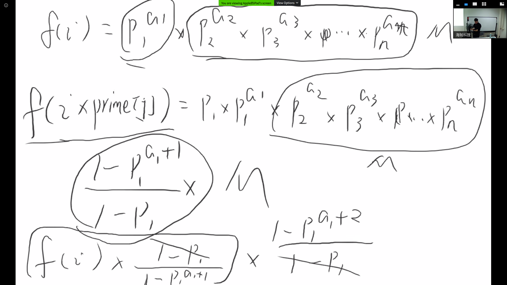

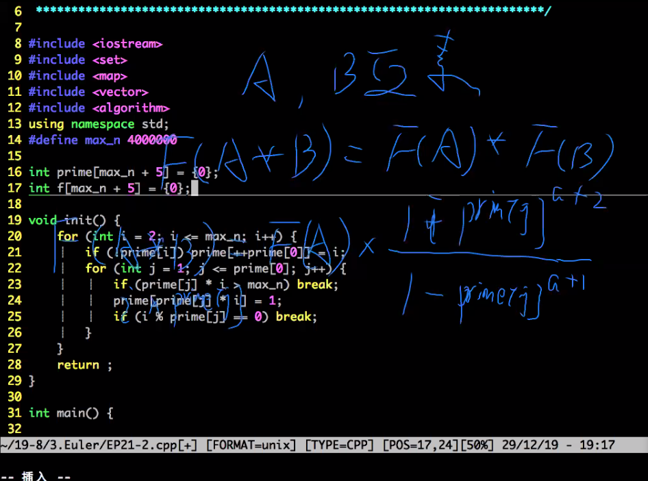

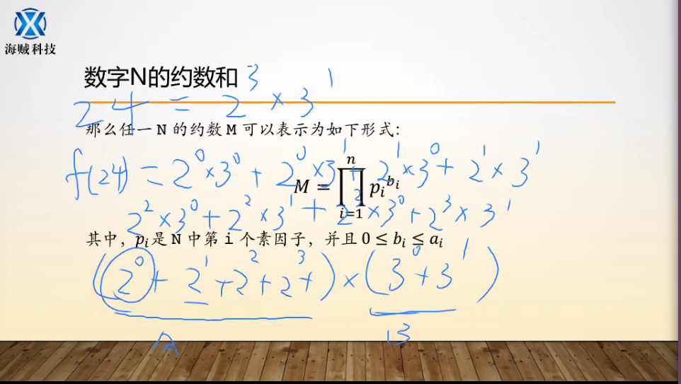


# 小项(练习)

## 阶乘分解素数

>#### 题目描述
>
> 给定整数 N(1≤N≤106)N(1≤N≤106)，试把阶乘 N!N! 分解质因数，按照算术基本定理的形式输出分解结果中的 pi 和 ci 即可。
>
>------
>
>#### 输入
>
> 一个整数 N。
>
>#### 输出
>
> N!N! 分解质因数后的结果，共若干行，每行一对 pi,ci，表示含有 pciipici 项。按照pi 从小到大的顺序输出。
>
>------
>
>#### 样例输入
>
>```
>5
>```
>
>#### 样例输出
>
>```
>2 3
>3 1
>5 1
>```
>
>#### 样例说明
>
>
>
>5!=120=23∗31∗51

```cpp
#include<iostream>
#include<cstdio>
#include<cmath>
#include<cstring>
#include<iomanip>
#include<algorithm>
#include<map>
#include<vector>
using namespace std;
#define max_n 150000

int cnt[max_n];

int prime[max_n];
void init() {
    for(int i = 2; i <= max_n; i++) {
        if(!prime[i]) {
            prime[++prime[0]] = i;
        }
        for(int j = 1; j <= prime[0]; j++) {
            if(i * prime[j] > max_n)break;
            prime[i * prime[j]] = 1;
            if(i % prime[j] == 0)break;
        }
    }
}

// <1>

int main() {
    int n;
    cin >> n;
    for(int i = 2; i <= n; i++) {
        int num = i;
        for(int j = 2; j * j <= num; j++) {
            if(num % j)continue; // j为素数往下走．．．若９%2 != 0不往下走9 % 3往下走
            while(num % j == 0) { // 素数ｊ
                cnt[j]++;　// ｃｎｔ[j] 存素数ｊ的个数
                num /= j;　
            }
            cnt[num] ++;　// 2  * 2 * 3得把最后一个３存上
        }
        cnt[i]++;　// 不进循环
    }
    init();
    for(int i = 1;  prime[i] <= n; i++) {
        cout << prime[i] <<' ' << cnt[prime[i]] << endl;
    }
    return 0;
}

// <2>
void init(int n) {
    for(int i = 2; i <= n; i++) {
        if(!prime[i]) {
            prime[++prime[0]] = i;
        }
        for(int j = 1; j <= prime[0]; j++) {
            if(i * prime[j] > n)break;
            prime[i * prime[j]] = 1;
            if(i % prime[j] == 0)break;
        }
    }
}

int main() {
    int n;;
    cin >> n;
    init(n);
    for(int i = 2; i <= n; i++) {　// 遍历２　．　３　．　４　．　５　／／正好　５！＝ 2 * 3 * 4 *5
        int temp = i;
        for(int j = 1; j <= prime[0] && temp >= prime[j]; j++) {　// 遍历比ｔｅｍｐ小的素数
            while(temp % prime[j] == 0) {　// 得知ｔｅｍｐ每个数中有几个素数
                temp /= prime[j];    
                cnt[prime[j]]++;　// 将素数存起来
            } 
        }
    }
    for(int i = 1; i <= prime[0]; i++) {
        if(!cnt[prime[i]])continue;
        cout << prime[i] << ' '<< cnt[prime[i]] << endl;
    }
    return 0;
}
/*
5 !  = １ 　＊　２　＊　３　＊　４　＊　５
2中含１个２
３中含１个３
４中含２个２
５中含１个５
所以遍历每个数中的素数，因为一个数是由若干个素数乘积组成的；
所用的算法是：
while(temp % prime[j] == 0) {
temp /= prime[j];
cnt[prime[j]] ++; //计数
}
然后外层循环一下从２～５就ｏｋ了
*/

 // <3>


void init(int n) {
    for(int i = 2; i <= n; i++) {
        if(!prime[i]) {
            prime[++prime[0]] = i;
        }
        for(int j = 1; j <= prime[0]; j++) {
            if(i * prime[j] > n)break;
            prime[i * prime[j]] = 1;
            if(i % prime[j] == 0)break;
        }
    }
}

int main() {
    long long n;
    cin >> n;
    init(n);
    for(int j = 1; j <= prime[0]; j++) {
        long long temp = prime[i], cnt = 0; //先将ｔｅｍｐ等于一个素数
        while(temp <= n) {
            cnt += n / temp;
            temp *= prime[j];
        }
        cout << prime[j] <<' '<< cnt << endl;
    }
    return 0;
}
/*
例如　：5 4 3 2 1
先将素数２的出掉  cnt += n /temp    ==> cnt += 5 / 2 , 将２出掉，temp *= prime[j]   ==>  temp *= 2 
cnt = 2, temp = 2 * 2 = 4;
下一次将４筛掉 cnt += n / temp ==> 5 / 4 则cnt = 2 + 1 = 3, temp *= 2 >>> 4 * 2 = 8 > 5 
此时将２出尽
然后从下一个素数开始３
．．．．．
．．．
．．
．
*/
```

